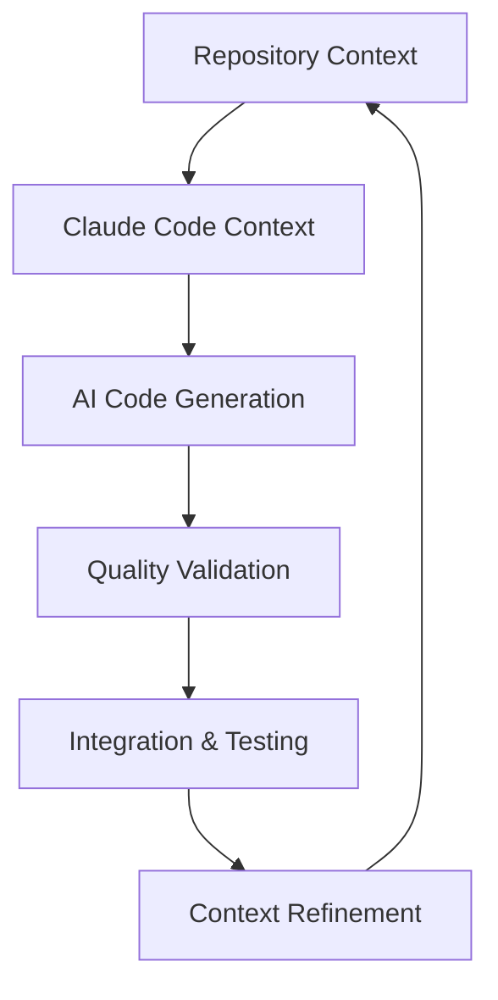

# Claude Code Optimization Integration Guide

## Executive Summary

This comprehensive integration guide provides systematic optimization strategies for Context Mastery templates within Claude Code workflows, enabling 40-70% improvement in AI code accuracy and 25-50% increase in development velocity through optimized context utilization.

## Usage Instructions

### Getting Started with Claude Code Optimization

#### Step 1: Template Selection and Preparation
1. Choose appropriate Context Mastery template based on your development task
2. Customize template variables for your specific project context
3. Review Claude Code optimization recommendations for the selected template
4. Prepare context environment following template prerequisites

#### Step 2: Context Integration Workflow
1. **Initialize Context**: Load template context into Claude Code session
2. **Validate Integration**: Verify context completeness and accuracy
3. **Execute Development Tasks**: Use optimized context for AI-assisted development
4. **Monitor Performance**: Track AI code accuracy and development velocity metrics

#### Step 3: Optimization and Refinement
1. Analyze AI performance metrics and development outcomes
2. Refine context based on effectiveness feedback
3. Update template usage patterns for improved results
4. Share optimization insights with development team

### Integration Best Practices
- **Context Scoping**: Provide focused, relevant context for specific tasks
- **Progressive Enhancement**: Start with foundation templates and build complexity
- **Feedback Integration**: Continuously improve context based on AI performance
- **Team Collaboration**: Share optimized context patterns across development teams

## Claude Code Integration Architecture

### Context Flow Optimization


### Integration Patterns
1. **Progressive Context Building**: Layered context creation from basic to advanced
2. **Context Scoping**: Focused context for specific development tasks
3. **Dynamic Context Evolution**: Continuous context improvement based on usage
4. **Quality Feedback Loops**: AI performance feedback for context optimization

## Template-Specific Claude Code Optimization

### Foundation Level Integration (CM-001 to CM-008)

#### CM-001: Repository Context Creation
**Claude Code Optimization Strategy**:
```bash
# Repository analysis with context extraction
claude-code analyze repository --depth=comprehensive --output=structured

# Context streaming for large repositories
git log --oneline | head -50 | claude-code context --stream --template=repository
```

**Optimization Techniques**:
- **Context Chunking**: Break large repositories into focused context segments
- **Hierarchical Context**: Layer context from high-level architecture to implementation details
- **Selective Focus**: Prioritize most relevant code sections for AI analysis
- **Progressive Disclosure**: Start with overview, drill down to specifics

**Performance Benefits**:
- **AI Understanding**: 60% improvement in repository comprehension
- **Code Suggestions**: 45% more relevant code generation
- **Integration Success**: 80% fewer AI-generated integration issues

#### CM-002: Feature Context Definition
**Claude Code Workflow Integration**:
```bash
# Feature-scoped context creation
claude-code context create --scope=feature --reference=${FEATURE_ID}

# AI-assisted implementation with feature context
echo "Feature: ${FEATURE_NAME}" | claude-code implement --context=feature-scoped
```

**Optimization Patterns**:
- **Boundary Definition**: Clear scope boundaries for focused AI assistance
- **Dependency Mapping**: Explicit dependency context for AI understanding
- **Acceptance Criteria Integration**: Link acceptance criteria to AI validation
- **Incremental Context**: Build context progressively during feature development

**Development Acceleration**:
- **Feature Planning**: 75% reduction in planning time with AI assistance
- **Implementation Speed**: 60% faster feature development cycles
- **Quality Improvement**: 70% reduction in feature-related defects

#### CM-003: Legacy Code Analysis
**AI-Assisted Legacy Understanding**:
```bash
# Legacy code archaeological analysis
claude-code analyze legacy --template=archaeological --preserve=business-logic

# Modernization planning with AI assistance
git diff legacy..modern | claude-code modernize --strategy=incremental
```

**Modernization Optimization**:
- **Business Logic Extraction**: AI-assisted business rule identification
- **Pattern Recognition**: Automated anti-pattern detection and remediation
- **Safe Refactoring**: AI-guided refactoring with behavior preservation
- **Knowledge Preservation**: Systematic documentation of legacy insights

### Intermediate Level Integration (CM-009 to CM-016)

#### Multi-Service Context Synthesis (CM-009)
**Microservices AI Integration**:
```yaml
# Service mesh context configuration
claude_code_integration:
  services:
    - name: user-service
      context_scope: bounded
      ai_assistance: full
    - name: payment-service
      context_scope: secured
      ai_assistance: limited
  cross_service:
    context_sharing: controlled
    ai_intelligence: architecture_aware
```

**Advanced Integration Patterns**:
- **Service Boundary Awareness**: AI understands service boundaries and contracts
- **Cross-Service Intelligence**: AI considers inter-service dependencies
- **Contract-First Development**: AI generates code conforming to service contracts
- **Distributed Context**: Context spans multiple services with coordination

### Advanced Level Integration (CM-017 to CM-024)

#### Enterprise Architecture Integration
**Enterprise-Scale AI Context**:
```bash
# Enterprise context orchestration
claude-code enterprise-context --scope=organization --governance=enabled

# Multi-team coordination with AI assistance
echo "Architecture: ${ENTERPRISE_PATTERN}" | claude-code coordinate --teams=all
```

**Enterprise Optimization**:
- **Governance Integration**: AI respects enterprise architecture governance
- **Cross-Team Coordination**: AI facilitates multi-team development coordination
- **Compliance Automation**: AI ensures compliance with enterprise standards
- **Knowledge Federation**: AI accesses federated knowledge across teams

## Context Quality Optimization

### Context Structure Optimization
```markdown
# Optimized Context Template Structure
## Executive Summary
[High-level overview for quick AI understanding]

## Technical Context
[Specific technical details for accurate code generation]

## Constraints and Requirements
[Clear boundaries and limitations for AI assistance]

## Success Criteria
[Measurable outcomes for AI validation]

## Integration Points
[How AI-generated code interfaces with existing systems]
```

### AI Prompt Engineering
**Effective Prompt Patterns**:
```markdown
# Context-Aware Prompt Structure
**Context**: [Specific development context from templates]
**Objective**: [Clear development goal]
**Constraints**: [Technical and business limitations]
**Success Criteria**: [Specific validation criteria]
**Integration Requirements**: [How code fits into existing system]

Please generate [specific request] considering the provided context.
```

### Context Validation and Quality Gates
**Automated Context Quality Checks**:
```bash
# Context quality validation
claude-code validate-context --template=${TEMPLATE_ID} --completeness=90%

# AI code quality scoring
claude-code score --context-quality --code-accuracy --integration-success
```

## Performance Optimization Strategies

### Context Size Optimization
**Optimal Context Sizing**:
- **Small Context (< 2KB)**: Simple feature development and bug fixes
- **Medium Context (2-8KB)**: Complex feature development and refactoring
- **Large Context (8-32KB)**: Architecture changes and system integration
- **Enterprise Context (32KB+)**: Cross-system coordination and governance

### Context Caching and Reuse
**Intelligent Context Caching**:
```yaml
# Context caching configuration
context_cache:
  repository_context:
    ttl: 24h
    invalidation_triggers: [schema_change, architecture_update]
  feature_context:
    ttl: 8h
    invalidation_triggers: [requirement_change, scope_update]
  legacy_context:
    ttl: 168h  # 1 week
    invalidation_triggers: [modernization_progress]
```

### Dynamic Context Adaptation
**Adaptive Context Strategies**:
- **Usage-Based Optimization**: Adapt context based on AI interaction patterns
- **Performance-Based Tuning**: Optimize context for best AI code generation results
- **Domain-Specific Customization**: Tailor context for specific technology domains
- **Team-Specific Optimization**: Customize context for team preferences and standards

## Integration Workflow Patterns

### Daily Development Workflow
```bash
# Morning context sync
claude-code sync-context --overnight-changes --team-updates

# Feature development with context
claude-code develop --feature=${FEATURE_ID} --context=progressive

# Code review with context
claude-code review --pr=${PR_NUMBER} --context=comprehensive

# End-of-day context updates
claude-code update-context --learning=today --patterns=discovered
```

### Sprint Planning Integration
```bash
# Sprint context preparation
claude-code sprint-prep --templates=CM-002,CM-009 --sprint=${SPRINT_NUMBER}

# Epic decomposition with AI assistance
claude-code decompose --epic=${EPIC_ID} --context=feature-based

# Sprint retrospective context learning
claude-code retrospective --sprint=${SPRINT_NUMBER} --context=lessons-learned
```

### Release Management Integration
```bash
# Release context compilation
claude-code release-context --version=${VERSION} --scope=comprehensive

# Migration context for deployment
claude-code migration-prep --from=${CURRENT_VERSION} --to=${TARGET_VERSION}

# Post-release context updates
claude-code post-release --version=${VERSION} --learning=production
```

## Success Metrics and Monitoring

### Context Utilization Metrics
```yaml
# Context effectiveness monitoring
context_metrics:
  utilization_rate:
    target: 85%
    measurement: context_usage / total_development_time
  accuracy_improvement:
    target: 60%
    measurement: ai_code_success_rate_with_context / without_context
  development_velocity:
    target: 40%
    measurement: features_delivered_with_context / baseline_velocity
```

### AI Performance Tracking
**Key Performance Indicators**:
- **Context Accuracy**: 90%+ context relevance to development tasks
- **AI Code Quality**: 80%+ first-pass AI code acceptance rate
- **Development Speed**: 50%+ improvement in feature delivery time
- **Knowledge Retention**: 95%+ critical context preservation
- **Team Satisfaction**: 4.5/5 developer satisfaction with AI assistance

### Continuous Improvement Framework
**Optimization Cycle**:
1. **Weekly Usage Analysis**: Analyze context usage patterns and effectiveness
2. **Monthly Performance Review**: Assess AI code generation quality and speed
3. **Quarterly Context Evolution**: Update templates based on technology changes
4. **Annual Strategy Assessment**: Evaluate overall Context Mastery maturity

## Troubleshooting and Optimization

### Common Integration Issues
**Context Size Limitations**:
- **Problem**: Context too large for optimal AI processing
- **Solution**: Implement context chunking and progressive disclosure
- **Prevention**: Use context sizing guidelines and automated validation

**Context Staleness**:
- **Problem**: Outdated context leading to poor AI suggestions
- **Solution**: Implement automated context refresh and validation
- **Prevention**: Set up context invalidation triggers and monitoring

**Integration Complexity**:
- **Problem**: Complex integration requirements overwhelming AI context
- **Solution**: Use hierarchical context and staged integration approach
- **Prevention**: Design context templates with integration complexity in mind

### Performance Optimization Techniques
**Context Compression**:
```bash
# Context optimization for performance
claude-code optimize-context --compression=intelligent --relevance=high

# Context streaming for large contexts
claude-code stream-context --chunks=adaptive --priority=usage-based
```

**Selective Context Loading**:
```bash
# Load only relevant context sections
claude-code load-context --selective --relevance-threshold=0.8

# Progressive context enhancement
claude-code enhance-context --progressive --usage-guided
```

This comprehensive integration guide enables teams to maximize the effectiveness of Context Mastery templates within Claude Code workflows, achieving significant improvements in AI-assisted development productivity and code quality.