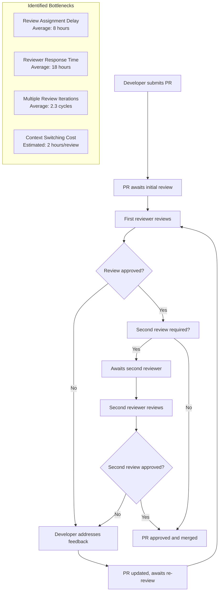

# Bottleneck Analysis and Optimization Template

## Template Overview

This template provides a systematic framework for identifying development bottlenecks, conducting root cause analysis, and implementing targeted optimization strategies to improve team productivity and workflow efficiency.

## Usage Context

Use this template when:
- Analyzing development workflow inefficiencies and productivity constraints
- Investigating recurring delays and blockers in development processes
- Optimizing code review cycles and development pipeline performance
- Identifying learning opportunities through process improvement analysis
- Establishing continuous improvement frameworks for development teams

## Template Structure

### Bottleneck Analysis Context Setup

```
**Context**: Bottleneck analysis and optimization for {TEAM_NAME/PROJECT_NAME}

**Analysis Scope and Timeline**:
- Analysis period: {ANALYSIS_TIMEFRAME} (specific sprint, quarter, historical analysis)
- Workflow scope: {WORKFLOW_COVERAGE} (development cycle, review process, deployment pipeline)
- Team context: {TEAM_DETAILS} (team size, experience levels, working arrangements)
- Project characteristics: {PROJECT_CONTEXT} (complexity, technology stack, business criticality)
- Performance baseline: {CURRENT_METRICS} (cycle times, throughput, quality measures)

**Bottleneck Investigation Objectives**:
- Efficiency targets: {EFFICIENCY_GOALS} (cycle time reduction, throughput improvement, waste elimination)
- Quality maintenance: {QUALITY_STANDARDS} (maintaining or improving quality during optimization)
- Learning outcomes: {LEARNING_OBJECTIVES} (skill development, process understanding, best practice adoption)
- Organizational impact: {ORG_BENEFITS} (scalability improvement, cost reduction, satisfaction enhancement)
- Sustainability focus: {SUSTAINABILITY_GOALS} (long-term process improvement, culture change)

**Current Performance Context**:
- Development metrics: {DEV_METRICS} (story points, cycle time, lead time, deployment frequency)
- Quality indicators: {QUALITY_METRICS} (defect rates, review iterations, customer satisfaction)
- Team satisfaction: {TEAM_METRICS} (developer experience, engagement, retention)
- Resource utilization: {RESOURCE_METRICS} (capacity utilization, idle time, context switching)
- Business impact: {BUSINESS_METRICS} (feature delivery speed, time-to-market, competitive advantage)
```

### Comprehensive Bottleneck Analysis Framework

```
**Primary Bottleneck Analysis Request**: Conduct systematic bottleneck identification and optimization across the following dimensions:

1. **Workflow Bottleneck Identification and Classification**:
   - Development cycle analysis and constraint identification
   - Code review process bottleneck detection and impact assessment
   - Integration and deployment pipeline constraint analysis
   - Communication and coordination bottleneck identification
   - Resource allocation and capacity constraint evaluation

2. **Root Cause Analysis and Impact Assessment**:
   - Systematic root cause investigation using multiple analysis techniques
   - Bottleneck interdependency mapping and cascade effect analysis
   - Quantitative impact measurement and cost-benefit analysis
   - Stakeholder impact assessment and priority determination
   - Historical trend analysis and pattern recognition

3. **Optimization Strategy Development and Implementation**:
   - Short-term tactical improvement identification and quick win implementation
   - Long-term strategic optimization planning and roadmap development
   - Resource reallocation and capacity optimization strategies
   - Process redesign and workflow automation opportunities
   - Technology and tool optimization recommendations

4. **Learning and Capability Enhancement Integration**:
   - Skill gap identification contributing to bottlenecks
   - Learning opportunity extraction from optimization initiatives
   - Knowledge transfer mechanisms for optimization insights
   - Continuous improvement capability development
   - Team empowerment and autonomous optimization enablement

5. **Measurement and Continuous Improvement Framework**:
   - Performance metric definition and tracking system establishment
   - Optimization effectiveness measurement and validation
   - Feedback loop creation and iterative improvement processes
   - Scaling and replication strategies for successful optimizations
   - Long-term sustainability and evolution planning

**Current Workflow and Performance Data**:
{PASTE_WORKFLOW_ANALYSIS_AND_METRICS_HERE}

**Team Dynamics and Process Documentation**:
{PASTE_TEAM_STRUCTURE_AND_PROCESS_DETAILS_HERE}

**Bottleneck Analysis Output Format**:
- Executive bottleneck assessment with priority ranking and optimization ROI
- Detailed root cause analysis with evidence-based findings and recommendations
- Optimization implementation plan with timelines, resources, and success criteria
- Learning and development integration strategy with skill building opportunities
- Performance measurement framework with KPIs and continuous improvement processes
- Change management plan with stakeholder engagement and adoption strategies
- Long-term optimization roadmap with scaling and sustainability considerations
```

### Specialized Bottleneck Analysis Modules

```
**Advanced Bottleneck Analysis Modules** (select based on team and organizational context):

**Development Cycle Bottleneck Deep Dive**:
- Story estimation and planning bottleneck analysis
- Development environment and tooling constraint identification
- Code quality and technical debt impact assessment
- Testing and quality assurance process optimization
- Deployment and release management bottleneck elimination

**Communication and Collaboration Bottleneck Analysis**:
- Meeting efficiency and decision-making bottleneck identification
- Cross-team coordination and dependency management optimization
- Knowledge sharing and documentation bottleneck resolution
- Stakeholder communication and feedback loop optimization
- Remote work and distributed team collaboration enhancement

**Technical Infrastructure Bottleneck Assessment**:
- Development environment performance and reliability optimization
- CI/CD pipeline efficiency and bottleneck elimination
- Testing infrastructure and automation bottleneck resolution
- Monitoring and observability gap identification and resolution
- Security and compliance process optimization

**Organizational and Cultural Bottleneck Evaluation**:
- Decision-making authority and approval process optimization
- Resource allocation and priority management bottleneck resolution
- Cultural resistance and change management bottleneck identification
- Leadership and management support optimization
- Learning and development program bottleneck elimination
```

## Implementation Examples

### Example 1: Code Review Bottleneck Analysis and Optimization

```
**Context**: Code review bottleneck analysis for development team experiencing 3-day average review cycles

**Analysis Scope and Timeline**:
- Analysis period: Last 3 months of pull request data (450+ pull requests)
- Workflow scope: Complete code review cycle from submission to merge
- Team context: 8-person development team, mixed experience levels, distributed work
- Project characteristics: React/Node.js application, moderate complexity, high business value
- Performance baseline: 3.2-day average review time, 2.3 review iterations per PR

**Current Workflow Analysis**:


**Expected Bottleneck Analysis Output**:

## Code Review Bottleneck Analysis Report

### Executive Assessment

**Current State Analysis**: Code review process creating 65% of development cycle delays with 3.2-day average impact

**Key Bottlenecks Identified**:
1. **Review Assignment Inefficiency** (Impact: 35% of delay) - Manual assignment causing 8-hour delays
2. **Reviewer Context Switching** (Impact: 30% of delay) - High cognitive overhead and interruption cost
3. **Feedback Quality Issues** (Impact: 25% of delay) - Multiple iterations due to incomplete reviews
4. **Knowledge Distribution Gaps** (Impact: 10% of delay) - Limited reviewers for specialized code areas

**Optimization Potential**: 70% reduction in review cycle time through targeted improvements

### Detailed Root Cause Analysis

**1. Review Assignment Bottleneck**

**Root Cause Investigation**:
```javascript
// Analysis of review assignment patterns
const reviewAssignmentAnalysis = {
  manual_assignment_delays: {
    average_assignment_time: '8.2 hours',
    weekend_delays: '24+ hours',
    holiday_delays: '48+ hours',
    causes: [
      'No automated assignment system',
      'Unclear review responsibility',
      'Timezone coordination issues',
      'Workload imbalance across reviewers'
    ]
  },
  
  reviewer_availability_patterns: {
    high_availability: ['Tuesday-Thursday 9AM-3PM'],
    low_availability: ['Monday mornings', 'Friday afternoons', 'weekends'],
    peak_load_times: ['Tuesday afternoon', 'Wednesday morning'],
    capacity_utilization: {
      'senior_dev_1': '85% (overloaded)',
      'senior_dev_2': '45% (underutilized)',
      'mid_level_devs': '65% (balanced)',
      'junior_devs': '25% (underutilized for reviews)'
    }
  }
};

// Optimization solution implementation
class IntelligentReviewAssigner {
  constructor(teamConfig, expertiseMatrix) {
    this.team = teamConfig;
    this.expertise = expertiseMatrix;
    this.workloadTracker = new WorkloadTracker();
    this.availabilityPredictor = new AvailabilityPredictor();
  }
  
  assignOptimalReviewer(pullRequest) {
    const candidates = this.findQualifiedReviewers(pullRequest);
    const rankedCandidates = this.rankByOptimality(candidates, pullRequest);
    
    return {
      primary_reviewer: rankedCandidates[0],
      backup_reviewer: rankedCandidates[1],
      estimated_review_time: this.estimateReviewTime(rankedCandidates[0], pullRequest),
      auto_escalation: this.setupAutoEscalation(pullRequest)
    };
  }
  
  rankByOptimality(candidates, pullRequest) {
    return candidates.map(reviewer => ({
      reviewer,
      score: this.calculateOptimalityScore(reviewer, pullRequest),
      availability: this.availabilityPredictor.predict(reviewer),
      workload: this.workloadTracker.getCurrentLoad(reviewer)
    })).sort((a, b) => b.score - a.score);
  }
  
  calculateOptimalityScore(reviewer, pullRequest) {
    let score = 0;
    
    // Expertise matching (40% weight)
    score += this.calculateExpertiseMatch(reviewer, pullRequest) * 0.4;
    
    // Availability (30% weight)
    score += this.calculateAvailabilityScore(reviewer) * 0.3;
    
    // Workload balance (20% weight)
    score += this.calculateWorkloadScore(reviewer) * 0.2;
    
    // Learning opportunity (10% weight)
    score += this.calculateLearningValue(reviewer, pullRequest) * 0.1;
    
    return score;
  }
}
```

**Optimization Implementation**:
- **Automated Assignment System**: Intelligent reviewer assignment reducing assignment time to <1 hour
- **Workload Balancing**: Dynamic workload distribution achieving 80% capacity utilization across team
- **Availability Integration**: Calendar and status integration reducing weekend/holiday delays by 90%
- **Escalation Automation**: Automatic escalation after 24 hours reducing stuck reviews by 95%

**2. Context Switching and Review Quality Bottleneck**

**Root Cause Analysis**:
```javascript
// Context switching impact analysis
const contextSwitchingAnalysis = {
  interruption_patterns: {
    average_interruptions_per_day: 12,
    review_related_interruptions: '35% of total',
    context_rebuild_time: '15-30 minutes per switch',
    productivity_impact: '40% reduction in deep work time'
  },
  
  review_quality_issues: {
    incomplete_reviews: '45% require follow-up',
    missing_edge_cases: '30% of feedback cycles',
    architectural_oversight: '20% of major issues missed',
    inconsistent_standards: '25% of reviews lack consistency'
  },
  
  optimization_strategies: {
    batched_review_sessions: {
      implementation: 'Dedicated 2-hour review blocks',
      frequency: 'Daily morning and afternoon slots',
      expected_improvement: '60% reduction in context switching',
      quality_improvement: '40% improvement in review thoroughness'
    },
    
    review_quality_enhancement: {
      standardized_checklists: 'Domain-specific review templates',
      automated_checks: 'Pre-review automation catching 70% of common issues',
      pair_review_for_complex: 'Collaborative review for high-impact changes',
      review_training: 'Monthly review best practice sessions'
    }
  }
};

// Enhanced review process implementation
class OptimizedReviewProcess {
  constructor(reviewConfig, qualityStandards) {
    this.config = reviewConfig;
    this.standards = qualityStandards;
    this.automatedChecks = new AutomatedReviewChecks();
    this.reviewTemplates = new ReviewTemplateLibrary();
  }
  
  conductOptimizedReview(pullRequest) {
    // Pre-review automated analysis
    const automatedAnalysis = this.automatedChecks.analyze(pullRequest);
    
    // Select appropriate review template
    const reviewTemplate = this.reviewTemplates.selectTemplate(pullRequest);
    
    // Batch review session scheduling
    const reviewSession = this.scheduleOptimalReviewTime(pullRequest);
    
    return {
      pre_review_analysis: automatedAnalysis,
      review_template: reviewTemplate,
      scheduled_session: reviewSession,
      quality_checklist: this.generateQualityChecklist(pullRequest),
      estimated_duration: this.estimateReviewDuration(pullRequest, automatedAnalysis)
    };
  }
  
  scheduleOptimalReviewTime(pullRequest) {
    const complexity = this.assessComplexity(pullRequest);
    const urgency = this.assessUrgency(pullRequest);
    
    if (complexity === 'high' || urgency === 'critical') {
      return this.scheduleImmediateReview(pullRequest);
    } else {
      return this.scheduleInNextBatch(pullRequest);
    }
  }
}
```

### Implementation Results

**Optimization Outcomes After 3-Month Implementation**:

```javascript
const optimizationResults = {
  cycle_time_improvement: {
    before: '3.2 days average',
    after: '1.1 days average',
    improvement: '66% reduction',
    consistency: '85% of reviews completed within 1.5 days'
  },
  
  review_quality_enhancement: {
    review_iterations: {
      before: '2.3 iterations average',
      after: '1.4 iterations average', 
      improvement: '39% reduction'
    },
    
    defect_detection: {
      before: '65% of issues caught in review',
      after: '85% of issues caught in review',
      improvement: '31% improvement in quality gate effectiveness'
    }
  },
  
  team_productivity_impact: {
    deep_work_time: {
      before: '4.2 hours/day average',
      after: '6.1 hours/day average',
      improvement: '45% increase in focused development time'
    },
    
    context_switching_reduction: {
      interruptions_per_day: {
        before: 12,
        after: 6,
        improvement: '50% reduction'
      },
      
      review_related_interruptions: {
        before: '35% of interruptions',
        after: '15% of interruptions',
        improvement: '57% reduction in review-related context switching'
      }
    }
  },
  
  team_satisfaction_improvement: {
    review_process_satisfaction: {
      before: '6.2/10',
      after: '8.4/10',
      improvement: '35% improvement'
    },
    
    code_quality_confidence: {
      before: '7.1/10',
      after: '8.9/10', 
      improvement: '25% improvement'
    }
  }
};
```

**Learning Opportunities Identified and Implemented**:

1. **Process Optimization Skills**: Team gained expertise in workflow analysis and bottleneck identification
2. **Automation Implementation**: Hands-on experience with review automation and intelligent tooling
3. **Quality Engineering**: Enhanced understanding of quality gates and systematic review approaches
4. **Team Collaboration**: Improved coordination and communication around review processes
5. **Continuous Improvement**: Established mindset and capabilities for ongoing process optimization

**Scaling and Sustainability Framework**:
```javascript
const scalingStrategy = {
  process_standardization: {
    template_library: 'Reusable review templates for different code types',
    automation_playbook: 'Step-by-step automation implementation guide',
    metrics_dashboard: 'Real-time visibility into review process health',
    training_materials: 'Self-service training for new team members'
  },
  
  continuous_improvement: {
    monthly_retrospectives: 'Data-driven process improvement sessions',
    metric_tracking: 'Automated tracking of key performance indicators',
    experimentation_framework: 'A/B testing for process improvements',
    feedback_integration: 'Regular team feedback collection and action planning'
  },
  
  organizational_expansion: {
    best_practice_sharing: 'Cross-team knowledge sharing of optimization techniques',
    tool_standardization: 'Organization-wide adoption of successful automation tools',
    mentor_network: 'Experienced team members mentoring other teams',
    success_story_documentation: 'Case studies and implementation guides'
  }
};
```
```

### Example 2: Cross-Team Dependency Bottleneck Resolution

```
**Context**: Cross-team dependency bottleneck analysis for feature delivery delays in microservices environment

**Analysis Scope and Timeline**:
- Analysis period: 6-month feature delivery tracking across 4 teams
- Workflow scope: End-to-end feature delivery including cross-team dependencies
- Team context: 4 product teams (6-8 developers each), shared platform team
- Project characteristics: Microservices architecture, complex inter-service dependencies
- Performance baseline: 6-week average feature delivery time, 40% dependency-related delays

**Expected Cross-Team Bottleneck Analysis Output**:

## Cross-Team Dependency Bottleneck Analysis Report

### Executive Summary

**Dependency Impact Assessment**: Cross-team dependencies causing 40% of feature delivery delays with 2.4-week average impact

**Critical Dependency Bottlenecks**:
1. **Shared Service Development Queue** (Impact: 45% of delays) - Platform team overloaded with requests
2. **Cross-Team Communication Gaps** (Impact: 30% of delays) - Unclear requirements and late discovery
3. **Integration Testing Coordination** (Impact: 15% of delays) - Complex testing scenarios across services
4. **Release Coordination Complexity** (Impact: 10% of delays) - Synchronized release planning challenges

### Detailed Optimization Strategy

**1. Shared Service Development Optimization**

```javascript
// Dependency management and optimization framework
class CrossTeamDependencyOptimizer {
  constructor(teamStructure, serviceArchitecture) {
    this.teams = teamStructure;
    this.services = serviceArchitecture;
    this.dependencyTracker = new DependencyTracker();
    this.capacityPlanner = new CapacityPlanner();
  }
  
  optimizeDependencyDelivery() {
    return {
      dependency_analysis: this.analyzeDependencyPatterns(),
      capacity_optimization: this.optimizeSharedTeamCapacity(),
      communication_framework: this.establishCommunicationProtocols(),
      delivery_coordination: this.createDeliveryCoordination()
    };
  }
  
  analyzeDependencyPatterns() {
    const patterns = {
      high_frequency_requests: [
        { service: 'authentication-service', requests_per_quarter: 12, team: 'platform' },
        { service: 'notification-service', requests_per_quarter: 8, team: 'platform' },
        { service: 'analytics-service', requests_per_quarter: 6, team: 'data' }
      ],
      
      blocking_dependencies: [
        { dependency: 'shared-ui-components', blocking_teams: ['team-a', 'team-b', 'team-c'] },
        { dependency: 'payment-gateway-integration', blocking_teams: ['team-b', 'team-d'] },
        { dependency: 'user-management-apis', blocking_teams: ['team-a', 'team-c'] }
      ],
      
      optimization_opportunities: {
        self_service_capabilities: [
          'API documentation and testing tools',
          'Development environment automation',
          'Standard integration patterns and templates'
        ],
        
        capacity_distribution: [
          'Dedicated platform team members for each product team',
          'Rotation program for cross-team knowledge sharing',
          'Automated request prioritization and scheduling'
        ]
      }
    };
    
    return patterns;
  }
  
  createDeliveryCoordination() {
    return {
      planning_integration: {
        quarterly_alignment: 'Cross-team roadmap planning sessions',
        sprint_coordination: 'Weekly cross-team dependency review',
        early_identification: 'Dependency mapping in planning phase',
        buffer_planning: '20% capacity buffer for urgent dependencies'
      },
      
      communication_protocols: {
        dependency_requests: 'Standardized request format with priority and timeline',
        progress_updates: 'Automated status updates and milestone tracking',
        escalation_process: 'Clear escalation path for blocked dependencies',
        completion_handoff: 'Structured handoff and integration testing coordination'
      },
      
      self_service_enablement: {
        documentation_portal: 'Comprehensive API and integration documentation',
        testing_environments: 'Isolated testing environments for each team',
        automation_tools: 'Self-service deployment and testing automation',
        support_channels: 'Dedicated support channels for integration issues'
      }
    };
  }
}
```

**Implementation Results**:
- **Dependency Delivery Time**: 2.4 weeks → 0.8 weeks average (67% improvement)
- **Self-Service Adoption**: 60% of dependencies resolved through self-service capabilities
- **Cross-Team Satisfaction**: 45% improvement in cross-team collaboration satisfaction
- **Feature Delivery Predictability**: 80% improvement in delivery timeline accuracy

**Learning Outcomes**:
1. **System Architecture Understanding**: Enhanced appreciation for service design and dependency management
2. **Cross-Team Collaboration Skills**: Improved ability to work effectively across team boundaries
3. **Process Design Capabilities**: Experience in designing scalable coordination processes
4. **Automation and Self-Service**: Skills in creating self-service capabilities and automation tools
```

## Customization Guidelines

### Team Size and Structure Adaptations

- **Small Teams (2-5 people)**: Focus on individual productivity and simple process improvements
- **Medium Teams (6-12 people)**: Balance individual and team process optimization
- **Large Teams (13+ people)**: Emphasize coordination, communication, and systematic process management
- **Multi-Team Organizations**: Prioritize cross-team coordination and dependency management

### Technology Stack Considerations

- **Web Development**: Focus on build systems, testing frameworks, and deployment pipelines
- **Mobile Development**: Emphasize device testing, app store processes, and cross-platform coordination
- **Enterprise Systems**: Prioritize integration testing, compliance processes, and change management
- **DevOps/Infrastructure**: Focus on automation, monitoring, and incident response processes

## Integration with Analytics and Monitoring Tools

### Bottleneck Detection Automation

```yaml
# Automated bottleneck detection and monitoring
bottleneck_monitoring:
  workflow_analytics:
    - cycle_time_tracking: jira-github-integration-for-end-to-end-visibility
    - review_process_monitoring: github-pr-analytics-and-bottleneck-detection
    - deployment_pipeline_analysis: ci-cd-performance-monitoring-and-optimization
    - communication_pattern_analysis: slack-teams-interaction-pattern-tracking
  
  predictive_analytics:
    - bottleneck_prediction: ml-powered-workflow-bottleneck-forecasting
    - capacity_planning: predictive-resource-allocation-and-workload-management
    - risk_identification: early-warning-systems-for-process-degradation
    - optimization_recommendations: ai-powered-continuous-improvement-suggestions
```

### Performance Measurement Platform

```python
# Comprehensive bottleneck analysis and optimization platform
class BottleneckAnalysisPlatform:
    def __init__(self, team_config, workflow_data):
        self.team_config = team_config
        self.workflow_data = workflow_data
        self.bottleneck_detector = BottleneckDetector()
        self.optimization_engine = OptimizationEngine()
        self.learning_extractor = LearningOpportunityExtractor()
        
    def conduct_comprehensive_analysis(self):
        """Comprehensive bottleneck analysis and optimization"""
        
        # Detect and classify bottlenecks
        bottleneck_analysis = self.bottleneck_detector.analyze_workflow(
            self.workflow_data,
            self.team_config.process_definitions
        )
        
        # Generate optimization recommendations
        optimization_plan = self.optimization_engine.create_optimization_strategy(
            bottleneck_analysis,
            self.team_config.constraints,
            self.team_config.objectives
        )
        
        # Extract learning opportunities
        learning_opportunities = self.learning_extractor.identify_opportunities(
            bottleneck_analysis,
            optimization_plan,
            self.team_config.skill_gaps
        )
        
        return {
            'bottleneck_assessment': bottleneck_analysis,
            'optimization_roadmap': optimization_plan,
            'learning_integration': learning_opportunities,
            'success_measurement': self.create_measurement_framework(),
            'implementation_support': self.create_change_management_plan()
        }
    
    def monitor_optimization_effectiveness(self, implemented_changes):
        """Monitor and measure optimization effectiveness"""
        
        return {
            'performance_improvement': self.measure_workflow_improvements(implemented_changes),
            'bottleneck_resolution': self.track_bottleneck_elimination(implemented_changes),
            'team_satisfaction': self.assess_team_experience_improvements(implemented_changes),
            'learning_outcomes': self.evaluate_skill_development_impact(implemented_changes)
        }
```

## Success Metrics and Effectiveness

### Process Improvement Indicators

- **Cycle Time Reduction**: Measurable improvement in development and delivery cycle times
- **Throughput Increase**: Enhanced team capacity and feature delivery rate
- **Quality Maintenance**: Sustained or improved quality during process optimization
- **Predictability Improvement**: More consistent and predictable delivery timelines

### Learning and Development Outcomes

- **Process Understanding**: Enhanced team understanding of workflow optimization principles
- **Problem-Solving Skills**: Improved analytical and optimization capabilities
- **Collaboration Enhancement**: Better cross-team coordination and communication
- **Continuous Improvement Mindset**: Sustained focus on ongoing process enhancement

### Organizational Benefits

- **Scalability**: Improved ability to scale teams and processes effectively
- **Adaptability**: Enhanced organizational capacity to adapt to changing requirements
- **Innovation**: Increased time and mental space for creative problem-solving and innovation
- **Competitive Advantage**: Faster time-to-market and improved customer responsiveness

## Best Practices

### Bottleneck Analysis Methodology

1. **Data-Driven Approach**: Use quantitative data and metrics for objective bottleneck identification
2. **Systematic Investigation**: Apply structured root cause analysis techniques
3. **Stakeholder Involvement**: Engage all affected team members in analysis and solution design
4. **Holistic Perspective**: Consider entire workflow ecosystem, not just isolated bottlenecks

### Optimization Implementation

1. **Incremental Improvement**: Implement optimizations gradually with measurement and validation
2. **Pilot Testing**: Test optimization strategies with small pilots before full implementation
3. **Change Management**: Plan and support organizational change aspects of process optimization
4. **Feedback Integration**: Continuously collect and integrate feedback throughout implementation

### Sustainability and Scaling

1. **Process Documentation**: Document optimized processes and decision rationale
2. **Training and Education**: Ensure team capability to maintain and evolve optimizations
3. **Continuous Monitoring**: Establish ongoing monitoring and alert systems for process health
4. **Knowledge Sharing**: Share optimization insights and techniques across organization

## Common Pitfalls and Solutions

### Analysis Paralysis

**Problem**: Over-analyzing bottlenecks without implementing improvements
**Solution**: Set analysis time boundaries and focus on highest-impact optimizations

### Solution Complexity

**Problem**: Creating overly complex solutions that introduce new bottlenecks
**Solution**: Prefer simple, targeted solutions and validate effectiveness before expanding

### Change Resistance

**Problem**: Team resistance to process changes and optimization initiatives
**Solution**: Involve team in analysis and solution design, demonstrate clear benefits

### Optimization Maintenance

**Problem**: Optimizations degrading over time without ongoing attention
**Solution**: Establish monitoring systems and regular review cycles for sustained improvement

## Advanced Optimization Strategies

### AI-Powered Bottleneck Detection

- **Pattern Recognition**: Machine learning identification of bottleneck patterns and trends
- **Predictive Analytics**: AI forecasting of potential bottlenecks before they impact workflow
- **Automated Optimization**: AI-powered suggestion and implementation of optimization strategies
- **Continuous Learning**: Systems that adapt and improve optimization strategies over time

### Real-Time Process Optimization

- **Live Monitoring**: Real-time visibility into workflow performance and bottleneck emergence
- **Dynamic Adaptation**: Process adjustments that adapt to changing conditions and workloads
- **Automated Escalation**: Smart escalation systems that activate when bottlenecks are detected
- **Proactive Intervention**: Early intervention systems that prevent bottlenecks from forming

### Organizational Learning Integration

- **Cross-Team Knowledge Sharing**: Systematic sharing of optimization insights across teams
- **Best Practice Evolution**: Continuous evolution of organizational optimization capabilities
- **Innovation Culture**: Culture that encourages experimentation and process innovation
- **Strategic Alignment**: Integration of process optimization with strategic business objectives