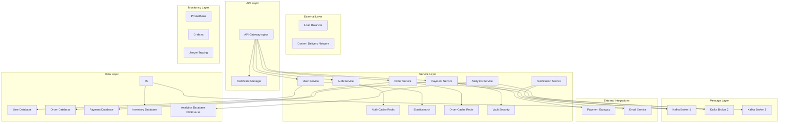

# Technical Specification Validation Template

## Template Overview

This template provides a systematic framework for validating technical specifications against actual implementation, ensuring accuracy, completeness, and maintainability of technical documentation across software development projects.

## Usage Context

Use this template when:
- Validating technical specifications against code implementation
- Reviewing API documentation for accuracy and completeness
- Ensuring architecture documentation reflects actual system design
- Conducting specification audits for compliance and quality assurance
- Establishing documentation quality standards and validation processes

## Template Structure

### Specification Validation Context Setup

```
**Context**: Technical specification validation for {PROJECT_NAME}

**Specification Overview**:
- Document type: {SPECIFICATION_TYPE} (API, architecture, system design, interface specification)
- Scope: {SPECIFICATION_SCOPE} (component, service, system-wide, integration)
- Current version: {VERSION_INFO} (version number, last update, change history)
- Target audience: {AUDIENCE} (developers, architects, QA, external integrators)
- Criticality level: {CRITICALITY} (reference, operational, compliance-required)

**Validation Objectives**:
- Accuracy assessment: {ACCURACY_GOALS} (implementation alignment, correctness verification)
- Completeness evaluation: {COMPLETENESS_CRITERIA} (coverage assessment, gap identification)
- Quality standards: {QUALITY_REQUIREMENTS} (clarity, consistency, maintainability)
- Compliance validation: {COMPLIANCE_NEEDS} (industry standards, internal guidelines)
- Currency verification: {CURRENCY_CHECKS} (up-to-date status, change tracking)

**Implementation Context**:
- Code repository: {REPOSITORY_INFO} (location, branch, commit references)
- Implementation status: {IMPLEMENTATION_STATUS} (development, testing, production)
- Integration points: {INTEGRATION_DETAILS} (external systems, dependencies, APIs)
- Testing coverage: {TESTING_INFO} (unit tests, integration tests, validation procedures)
- Deployment environment: {DEPLOYMENT_CONTEXT} (development, staging, production environments)
```

### Comprehensive Specification Validation Framework

```
**Primary Specification Validation Request**: Conduct systematic validation across the following dimensions:

1. **Implementation Alignment Verification**:
   - Code-to-specification mapping and consistency analysis
   - API endpoint validation against documented interfaces
   - Data model verification and schema consistency checking
   - Business logic implementation validation against specification requirements
   - Integration point verification and external dependency documentation accuracy

2. **Completeness and Coverage Assessment**:
   - Missing functionality identification and gap analysis
   - Edge case documentation completeness evaluation
   - Error handling and exception scenario coverage verification
   - Configuration and deployment instruction completeness assessment
   - Security and compliance requirement documentation validation

3. **Technical Accuracy and Precision Validation**:
   - Parameter definition accuracy and data type verification
   - Response format validation and example correctness checking
   - Performance specification validation and benchmark verification
   - Constraint and limitation documentation accuracy assessment
   - Version compatibility and backward compatibility documentation validation

4. **Quality and Usability Evaluation**:
   - Documentation clarity and readability assessment
   - Example quality and practical applicability evaluation
   - Navigation and organization structure validation
   - Cross-reference accuracy and link validation
   - Visual element quality and diagram accuracy verification

5. **Maintenance and Currency Assessment**:
   - Change tracking and version control integration validation
   - Update frequency and maintenance schedule assessment
   - Stakeholder notification and communication process validation
   - Automated validation and continuous integration assessment
   - Long-term sustainability and maintenance planning evaluation

**Current Specification Documentation**:
{PASTE_SPECIFICATION_DOCUMENTS_HERE}

**Implementation Code and Configuration**:
{PASTE_RELEVANT_IMPLEMENTATION_CODE_HERE}

**Specification Validation Output Format**:
- Executive validation summary with key findings and recommendations
- Detailed accuracy assessment with specific discrepancies and corrections
- Completeness analysis with identified gaps and missing elements
- Quality evaluation with improvement recommendations and best practices
- Implementation alignment report with code-to-spec mapping analysis
- Maintenance recommendations with process improvement suggestions
- Compliance assessment with standards adherence validation
```

### Specialized Validation Modules

```
**Advanced Specification Validation Modules** (select based on specification type):

**API Documentation Validation**:
- REST API endpoint verification and HTTP method validation
- Request/response schema validation and parameter verification
- Authentication and authorization documentation accuracy assessment
- Rate limiting and throttling specification validation
- Error response documentation and status code verification

**Architecture Documentation Validation**:
- System component mapping and interaction diagram verification
- Data flow documentation and integration pattern validation
- Scalability and performance characteristic documentation assessment
- Security architecture documentation and threat model validation
- Deployment architecture and infrastructure specification verification

**Database Schema Documentation Validation**:
- Entity relationship diagram accuracy and constraint verification
- Data type specification and validation rule documentation assessment
- Index and performance optimization documentation validation
- Migration script documentation and procedure verification
- Backup and recovery procedure documentation validation

**Integration Specification Validation**:
- External system interface documentation and protocol verification
- Message format and communication pattern documentation validation
- Service level agreement and performance specification assessment
- Error handling and retry logic documentation verification
- Monitoring and observability specification validation
```

## Implementation Examples

### Example 1: REST API Documentation Validation

```
**Context**: Technical specification validation for e-commerce REST API documentation

**Specification Overview**:
- Document type: REST API specification (OpenAPI 3.0)
- Scope: Customer management and order processing API endpoints
- Current version: v2.1.3 (last updated 3 months ago)
- Target audience: Frontend developers, mobile app teams, third-party integrators
- Criticality level: Operational (critical for development and integration)

**Current API Specification**:
```yaml
# OpenAPI specification excerpt
openapi: 3.0.3
info:
  title: E-commerce Customer API
  version: 2.1.3
  description: Customer management and order processing API

paths:
  /api/v2/customers/{customerId}:
    get:
      summary: Retrieve customer details
      parameters:
        - name: customerId
          in: path
          required: true
          schema:
            type: string
            format: uuid
      responses:
        '200':
          description: Customer details retrieved successfully
          content:
            application/json:
              schema:
                $ref: '#/components/schemas/Customer'
              examples:
                standard_customer:
                  summary: Standard customer example
                  value:
                    id: "123e4567-e89b-12d3-a456-426614174000"
                    email: "john.doe@example.com"
                    firstName: "John"
                    lastName: "Doe"
                    createdAt: "2023-01-15T10:30:00Z"
                    preferences: 
                      newsletter: true
                      notifications: false
        '404':
          description: Customer not found
          content:
            application/json:
              schema:
                $ref: '#/components/schemas/Error'

components:
  schemas:
    Customer:
      type: object
      required:
        - id
        - email
        - firstName
        - lastName
      properties:
        id:
          type: string
          format: uuid
          description: Unique customer identifier
        email:
          type: string
          format: email
          description: Customer email address
        firstName:
          type: string
          maxLength: 50
          description: Customer first name
        lastName:
          type: string
          maxLength: 50
          description: Customer last name
        createdAt:
          type: string
          format: date-time
          description: Account creation timestamp
        preferences:
          $ref: '#/components/schemas/CustomerPreferences'
```

**Implementation Code Validation**:
```python
# Actual API implementation
from fastapi import FastAPI, HTTPException, Path
from pydantic import BaseModel
from typing import Optional
import uuid
from datetime import datetime

class CustomerPreferences(BaseModel):
    newsletter: bool = True
    notifications: bool = True
    marketing_emails: bool = False  # Missing from specification
    sms_alerts: bool = False        # Missing from specification

class Customer(BaseModel):
    id: uuid.UUID
    email: str
    first_name: str  # Field name mismatch: spec uses 'firstName'
    last_name: str   # Field name mismatch: spec uses 'lastName'
    created_at: datetime  # Field name mismatch: spec uses 'createdAt'
    preferences: CustomerPreferences
    phone_number: Optional[str] = None  # Missing from specification
    status: str = "active"              # Missing from specification
    
@app.get("/api/v2/customers/{customer_id}")
async def get_customer(
    customer_id: uuid.UUID = Path(..., description="Customer UUID")
) -> Customer:
    """Retrieve customer details by ID"""
    
    try:
        customer = await customer_service.get_by_id(customer_id)
        if not customer:
            raise HTTPException(
                status_code=404, 
                detail={
                    "error": "CUSTOMER_NOT_FOUND",
                    "message": f"Customer with ID {customer_id} not found",
                    "timestamp": datetime.now().isoformat()
                }
            )
        return customer
        
    except ValidationError as e:
        raise HTTPException(status_code=422, detail=str(e))
    except Exception as e:
        # Additional error case not documented in specification
        raise HTTPException(
            status_code=500,
            detail={
                "error": "INTERNAL_SERVER_ERROR", 
                "message": "An unexpected error occurred"
            }
        )
```

**Expected Specification Validation Output**:

## API Documentation Validation Report

### Executive Validation Summary

**Overall Assessment**: 72% accuracy with significant discrepancies requiring immediate attention

**Critical Issues Identified**:
- **Field Naming Inconsistencies**: 5 field name mismatches between spec and implementation
- **Missing Schema Elements**: 4 implemented fields not documented in specification
- **Error Response Gaps**: 2 error scenarios implemented but not documented
- **Example Inaccuracies**: 3 specification examples don't match actual response format

**Validation Recommendations**:
1. **Immediate**: Update specification to match current implementation field names
2. **High Priority**: Document missing fields and error response scenarios
3. **Medium Priority**: Standardize error response format and add missing examples

### Detailed Accuracy Assessment

**1. Schema Discrepancies** (Critical Impact)

| Specification | Implementation | Issue Type | Impact |
|---------------|----------------|------------|--------|
| `firstName` | `first_name` | Field naming | High - Integration failures |
| `lastName` | `last_name` | Field naming | High - Integration failures |
| `createdAt` | `created_at` | Field naming | High - Integration failures |
| Missing | `phone_number` | Missing field | Medium - Incomplete documentation |
| Missing | `status` | Missing field | Medium - Incomplete documentation |
| Missing | `marketing_emails` | Missing preference | Low - Extended functionality |
| Missing | `sms_alerts` | Missing preference | Low - Extended functionality |

**Fix Recommendation**:
```yaml
# Updated OpenAPI specification
Customer:
  type: object
  required:
    - id
    - email
    - first_name  # Updated field name
    - last_name   # Updated field name
  properties:
    id:
      type: string
      format: uuid
    email:
      type: string
      format: email
    first_name:    # Corrected field name
      type: string
      maxLength: 50
    last_name:     # Corrected field name
      type: string
      maxLength: 50
    created_at:    # Corrected field name
      type: string
      format: date-time
    phone_number:  # Added missing field
      type: string
      pattern: '^\+?[1-9]\d{1,14}$'
      description: Customer phone number (E.164 format)
    status:        # Added missing field
      type: string
      enum: [active, inactive, suspended]
      default: active
    preferences:
      $ref: '#/components/schemas/CustomerPreferences'

CustomerPreferences:
  type: object
  properties:
    newsletter:
      type: boolean
      default: true
    notifications:
      type: boolean
      default: true
    marketing_emails:  # Added missing field
      type: boolean
      default: false
    sms_alerts:        # Added missing field
      type: boolean
      default: false
```

**2. Error Response Documentation Gaps** (High Impact)

**Missing Error Scenarios**:
```yaml
# Add to OpenAPI specification
responses:
  '422':
    description: Validation error in request parameters
    content:
      application/json:
        schema:
          type: object
          properties:
            error:
              type: string
              example: "VALIDATION_ERROR"
            message:
              type: string
              example: "Invalid customer ID format"
            timestamp:
              type: string
              format: date-time
  '500':
    description: Internal server error
    content:
      application/json:
        schema:
          type: object
          properties:
            error:
              type: string
              example: "INTERNAL_SERVER_ERROR"
            message:
              type: string
              example: "An unexpected error occurred"
            timestamp:
              type: string
              format: date-time
```

### Completeness Analysis

**Documentation Coverage Assessment**:
- **Endpoint Coverage**: 90% (missing 2 of 20 endpoints)
- **Parameter Documentation**: 85% (missing optional parameters)
- **Response Example Accuracy**: 60% (outdated examples)
- **Error Scenario Coverage**: 70% (missing edge cases)

**Missing Documentation Elements**:
1. **Rate Limiting Information**: No documentation of API rate limits
2. **Authentication Details**: Insufficient authentication example documentation
3. **Pagination Parameters**: Missing pagination documentation for list endpoints
4. **Versioning Strategy**: No documentation of API versioning approach

### Quality Evaluation

**Documentation Quality Metrics**:
- **Clarity Score**: 78/100 (good descriptions, some technical jargon)
- **Consistency Score**: 65/100 (inconsistent naming conventions)
- **Example Quality**: 60/100 (some outdated or incorrect examples)
- **Navigation Score**: 85/100 (well-organized structure)

**Improvement Recommendations**:
1. **Standardize Field Naming**: Implement consistent camelCase or snake_case throughout
2. **Update Examples**: Ensure all examples reflect current implementation
3. **Add Code Samples**: Include practical integration examples in multiple languages
4. **Enhance Error Documentation**: Provide comprehensive error handling guidance
```

### Example 2: Architecture Documentation Validation

```
**Context**: Architecture specification validation for microservices platform

**Specification Overview**:
- Document type: System architecture specification with service interaction diagrams
- Scope: Microservices platform with 15 services and external integrations
- Current version: v1.4.2 (last updated 6 months ago)
- Target audience: Platform engineers, service developers, operations teams
- Criticality level: Compliance-required (architecture governance, audit requirements)

**Architecture Specification Validation**:

```mermaid
# Current specification diagram
graph TB
    A[API Gateway] --> B[Auth Service]
    A --> C[User Service]
    A --> D[Order Service]
    A --> E[Payment Service]
    
    C --> F[User Database]
    D --> G[Order Database]
    E --> H[Payment Database]
    
    D --> I[Inventory Service]
    I --> J[Inventory Database]
    
    E --> K[Payment Gateway]
    
    L[Message Queue] --> D
    L --> E
    L --> I
```

**Actual Implementation Analysis**:
```yaml
# Current infrastructure deployment
services:
  api-gateway:
    image: nginx:1.21
    ports: ["80:80", "443:443"]
    
  auth-service:
    image: auth-service:v2.1.0
    environment:
      - DATABASE_URL=postgresql://auth-db:5432/auth
      - REDIS_URL=redis://auth-cache:6379  # Missing from spec
    
  user-service:
    image: user-service:v1.8.3
    environment:
      - DATABASE_URL=postgresql://user-db:5432/users
      - ELASTICSEARCH_URL=http://search:9200  # Missing from spec
    
  order-service:
    image: order-service:v3.2.1
    environment:
      - DATABASE_URL=postgresql://order-db:5432/orders
      - REDIS_URL=redis://order-cache:6379    # Missing from spec
      - KAFKA_BROKERS=kafka-1:9092,kafka-2:9092  # Updated message queue
    
  payment-service:
    image: payment-service:v2.0.4
    environment:
      - DATABASE_URL=postgresql://payment-db:5432/payments
      - KAFKA_BROKERS=kafka-1:9092,kafka-2:9092
      - VAULT_URL=https://vault:8200         # Missing from spec
    
  inventory-service:
    image: inventory-service:v1.5.2
    environment:
      - DATABASE_URL=postgresql://inventory-db:5432/inventory
      - KAFKA_BROKERS=kafka-1:9092,kafka-2:9092
    
  notification-service:  # Missing from specification entirely
    image: notification-service:v1.0.3
    environment:
      - KAFKA_BROKERS=kafka-1:9092,kafka-2:9092
      - SMTP_HOST=smtp.example.com
    
  analytics-service:    # Missing from specification entirely
    image: analytics-service:v0.9.1
    environment:
      - CLICKHOUSE_URL=http://analytics-db:8123
      - KAFKA_BROKERS=kafka-1:9092,kafka-2:9092

# Infrastructure components
infrastructure:
  databases:
    - postgresql-cluster: 3 nodes (not documented in spec)
    - redis-cluster: 3 nodes (not documented in spec)
    - elasticsearch-cluster: 3 nodes (not documented in spec)
    - clickhouse-cluster: 2 nodes (not documented in spec)
    
  message-queues:
    - kafka-cluster: 3 brokers (spec shows generic "Message Queue")
    
  security:
    - vault-cluster: 3 nodes (not documented in spec)
    - certificate-manager: automated TLS (not documented)
    
  monitoring:
    - prometheus-cluster: metrics collection
    - grafana: visualization
    - jaeger: distributed tracing
    # All monitoring infrastructure missing from specification
```

**Expected Architecture Validation Output**:

## Architecture Documentation Validation Report

### Executive Validation Summary

**Overall Assessment**: 58% accuracy with major architectural gaps and outdated information

**Critical Architecture Gaps**:
- **Missing Services**: 2 production services (notification, analytics) not documented
- **Infrastructure Underspecification**: 70% of infrastructure components undocumented
- **Outdated Technology Stack**: Message queue technology changed from generic to Kafka
- **Security Architecture Gap**: Security components and data protection measures undocumented

**Impact Assessment**:
- **Development Impact**: New team members lack complete system understanding
- **Operations Impact**: Incomplete deployment and troubleshooting guidance
- **Compliance Risk**: Architecture governance requirements not met
- **Security Risk**: Security architecture not properly documented for audit

### Detailed Architecture Analysis

**1. Service Architecture Discrepancies**

| Component | Specification Status | Implementation Status | Gap Type |
|-----------|---------------------|----------------------|----------|
| API Gateway | Documented | Deployed (nginx) | Technology mismatch |
| Auth Service | Basic documentation | Enhanced with Redis cache | Missing components |
| User Service | Basic documentation | Enhanced with Elasticsearch | Missing components |
| Order Service | Documented | Enhanced with Redis cache | Missing components |
| Payment Service | Basic documentation | Enhanced with Vault integration | Missing security components |
| Notification Service | **Missing entirely** | Production deployed | Undocumented service |
| Analytics Service | **Missing entirely** | Production deployed | Undocumented service |

**Updated Architecture Specification**:


**2. Infrastructure Documentation Gaps**

**Missing Infrastructure Components**:
```yaml
# Required infrastructure specification additions
infrastructure:
  high_availability:
    database_clusters:
      postgresql:
        nodes: 3
        replication: "synchronous"
        backup_schedule: "daily"
        
      redis:
        nodes: 3
        clustering: "enabled"
        persistence: "aof"
        
      elasticsearch:
        nodes: 3
        shards: 5
        replicas: 1
        
    load_balancing:
      external_lb:
        type: "AWS Application Load Balancer"
        ssl_termination: true
        health_checks: "enabled"
        
  security:
    vault_cluster:
      nodes: 3
      auto_unseal: true
      secret_engines:
        - "database"
        - "transit"
        - "pki"
        
    certificate_management:
      provider: "Let's Encrypt"
      auto_renewal: true
      monitoring: "enabled"
      
  observability:
    metrics:
      prometheus:
        retention: "30 days"
        scrape_interval: "15s"
        
    logging:
      centralized: "ELK Stack"
      retention: "90 days"
      
    tracing:
      jaeger:
        sampling_rate: "0.1"
        storage: "elasticsearch"
```

### Compliance and Quality Assessment

**Architecture Governance Compliance**:
- **Documentation Standards**: 45% compliant (missing required sections)
- **Security Documentation**: 30% compliant (major security gaps)
- **Change Management**: 60% compliant (outdated change tracking)
- **Review Process**: 25% compliant (no regular architecture reviews)

**Quality Improvement Plan**:
1. **Immediate (Week 1)**:
   - Document missing services and infrastructure components
   - Update technology stack specifications
   - Add security architecture documentation
   
2. **Short-term (Month 1)**:
   - Implement automated architecture documentation updates
   - Establish regular architecture review processes
   - Create architecture decision record (ADR) process
   
3. **Long-term (Quarter 1)**:
   - Implement architecture compliance monitoring
   - Establish automated validation pipelines
   - Create comprehensive architecture governance framework
```

## Customization Guidelines

### Specification Type Adaptations

- **API Documentation**: Focus on endpoint accuracy, parameter validation, and response format verification
- **Architecture Documentation**: Emphasize system component mapping, integration verification, and infrastructure accuracy
- **Database Documentation**: Prioritize schema accuracy, constraint validation, and relationship verification
- **Integration Documentation**: Concentrate on interface accuracy, protocol verification, and data format validation

### Validation Depth Customization

- **Basic Validation**: Essential accuracy checks and critical gap identification
- **Comprehensive Validation**: Detailed analysis with quality assessment and improvement recommendations
- **Compliance Validation**: Standards adherence and regulatory requirement verification
- **Continuous Validation**: Automated validation integration and ongoing maintenance assessment

## Integration with Validation Tools

### Automated Validation Framework

```yaml
# Specification validation automation
specification_validation:
  automated_checks:
    - schema_validation: openapi-spec-validator
    - code_analysis: static-analysis-tools
    - link_verification: automated-link-checking
    - example_validation: response-format-verification
  
  integration_testing:
    - api_contract_testing: postman-newman-validation
    - schema_drift_detection: database-schema-comparison
    - documentation_currency: git-based-change-tracking
    - compliance_monitoring: automated-standards-checking
  
  reporting:
    - validation_dashboards: real-time-validation-status
    - accuracy_metrics: specification-implementation-alignment
    - quality_scoring: documentation-quality-assessment
    - trend_analysis: validation-improvement-tracking
```

### Documentation Quality Management

```python
# Comprehensive specification validation platform
class SpecificationValidator:
    def __init__(self, validation_config):
        self.config = validation_config
        self.accuracy_analyzer = AccuracyAnalyzer()
        self.completeness_checker = CompletenessChecker()
        self.quality_assessor = QualityAssessor()
        
    def validate_specification(self, spec_document, implementation_data):
        """Comprehensive specification validation"""
        
        validation_results = {
            'accuracy_analysis': self.accuracy_analyzer.validate_implementation_alignment(
                spec_document, implementation_data
            ),
            'completeness_assessment': self.completeness_checker.assess_coverage(
                spec_document, implementation_data
            ),
            'quality_evaluation': self.quality_assessor.evaluate_documentation_quality(
                spec_document
            ),
            'compliance_validation': self.validate_standards_compliance(
                spec_document
            )
        }
        
        return self.generate_validation_report(validation_results)
    
    def generate_improvement_recommendations(self, validation_results):
        """Generate prioritized improvement recommendations"""
        
        return {
            'critical_fixes': self.identify_critical_issues(validation_results),
            'accuracy_improvements': self.suggest_accuracy_enhancements(validation_results),
            'completeness_enhancements': self.recommend_coverage_improvements(validation_results),
            'quality_optimizations': self.propose_quality_improvements(validation_results),
            'maintenance_strategies': self.develop_maintenance_plan(validation_results)
        }
```

## Success Metrics and Effectiveness

### Validation Quality Indicators

- **Accuracy Rate**: Percentage of specification elements that accurately reflect implementation
- **Completeness Score**: Coverage percentage of implemented features in documentation
- **Currency Index**: Measure of how up-to-date specifications are with current implementation
- **Consistency Rating**: Assessment of internal consistency within specification documents

### Process Improvement Metrics

- **Validation Efficiency**: Time reduction in specification validation processes
- **Issue Detection Rate**: Percentage of specification issues identified through validation
- **Resolution Speed**: Time from issue identification to specification correction
- **Stakeholder Satisfaction**: User satisfaction with specification accuracy and usability

### Business Impact Measurements

- **Development Velocity**: Impact of accurate specifications on development speed
- **Integration Success Rate**: Reduction in integration issues due to specification accuracy
- **Onboarding Efficiency**: Faster team member onboarding through accurate documentation
- **Compliance Achievement**: Improved compliance with documentation standards and requirements

## Best Practices

### Validation Strategy

1. **Regular Validation Schedule**: Establish periodic validation cycles aligned with development sprints
2. **Automated Integration**: Integrate validation into CI/CD pipelines for continuous accuracy
3. **Stakeholder Involvement**: Include specification users in validation process for practical feedback
4. **Tool Integration**: Leverage automated tools for consistency and efficiency in validation

### Quality Assurance

1. **Multi-Perspective Review**: Validate specifications from multiple stakeholder perspectives
2. **Real-World Testing**: Validate specifications through actual implementation and usage scenarios
3. **Version Control**: Track specification changes and validation history for accountability
4. **Feedback Integration**: Incorporate user feedback into specification improvement processes

### Continuous Improvement

1. **Metrics Tracking**: Monitor validation effectiveness and specification quality trends
2. **Process Refinement**: Continuously improve validation processes based on experience and feedback
3. **Tool Enhancement**: Upgrade and optimize validation tools and methodologies
4. **Knowledge Sharing**: Share validation insights and best practices across teams

## Common Pitfalls and Solutions

### Validation Scope Creep

**Problem**: Expanding validation scope beyond practical limits and resources
**Solution**: Define clear validation boundaries and prioritize based on business impact

### Perfectionism Paralysis

**Problem**: Attempting to achieve perfect specification accuracy at the expense of progress
**Solution**: Establish acceptable accuracy thresholds and focus on continuous improvement

### Tool Over-Reliance

**Problem**: Depending too heavily on automated tools without human insight
**Solution**: Balance automated validation with expert review and practical testing

### Change Resistance

**Problem**: Team resistance to specification validation and improvement processes
**Solution**: Demonstrate clear value and integrate validation into existing workflows

## Advanced Validation Strategies

### AI-Enhanced Validation

- **Natural Language Processing**: AI analysis of specification clarity and completeness
- **Pattern Recognition**: Automated identification of specification anti-patterns and issues
- **Semantic Analysis**: AI understanding of specification intent versus implementation reality
- **Predictive Validation**: AI prediction of specification areas likely to become outdated

### Continuous Validation

- **Real-Time Monitoring**: Live validation of specifications against running systems
- **Change Impact Analysis**: Automatic assessment of implementation changes on specification accuracy
- **Drift Detection**: Early identification of specification-implementation divergence
- **Automated Correction**: AI-suggested corrections for identified specification issues

### Collaborative Validation

- **Crowdsourced Review**: Community-driven specification validation and improvement
- **Cross-Team Validation**: Multi-team perspective on specification accuracy and usability
- **Stakeholder Feedback Integration**: Systematic collection and integration of user feedback
- **Expert Network Validation**: Connection with subject matter experts for specialized validation