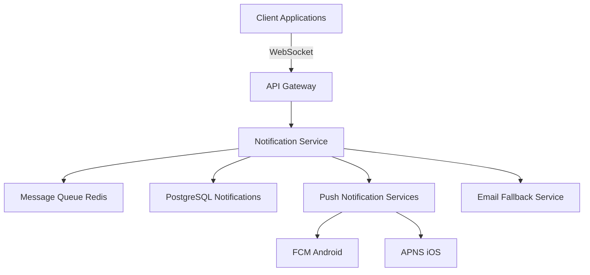

# Comprehensive Change Documentation Template

## Template Overview

This template provides a systematic framework for generating complete, contextual documentation for code changes, ensuring all stakeholders understand the what, why, and how of modifications to the codebase.

## Usage Context

Use this template when:
- Documenting significant code changes and feature implementations
- Creating comprehensive pull request descriptions and change logs
- Establishing documentation standards for development teams
- Generating release notes and deployment documentation
- Providing context for future maintenance and debugging efforts

## Template Structure

### Change Documentation Context Setup

```
**Context**: Comprehensive change documentation for {PROJECT_NAME}

**Change Overview**:
- Change type: {CHANGE_TYPE} (feature, bugfix, refactor, performance, security)
- Scope: {CHANGE_SCOPE} (component, module, system-wide, infrastructure)
- Impact level: {IMPACT_LEVEL} (minor, moderate, major, breaking change)
- Urgency: {URGENCY_LEVEL} (routine, important, urgent, critical)
- Related work: {RELATED_ITEMS} (tickets, issues, dependencies, follow-up work)

**Documentation Objectives**:
- Audience: {TARGET_AUDIENCE} (developers, QA, product managers, operations)
- Detail level: {DOCUMENTATION_DEPTH} (summary, detailed, comprehensive, technical deep-dive)
- Maintenance context: {MAINTENANCE_FOCUS} (troubleshooting, future development, operations)
- Knowledge transfer: {KNOWLEDGE_GOALS} (team onboarding, domain understanding, process documentation)
- Compliance requirements: {COMPLIANCE_NEEDS} (audit trails, regulatory documentation, change control)

**Change Context**:
- Business justification: {BUSINESS_RATIONALE} (user needs, performance requirements, technical debt)
- Technical constraints: {TECHNICAL_CONSTRAINTS} (backward compatibility, performance, security)
- Dependencies: {DEPENDENCIES} (external systems, other changes, infrastructure updates)
- Risk considerations: {RISK_FACTORS} (deployment risks, user impact, rollback procedures)
```

### Comprehensive Documentation Framework

```
**Primary Documentation Request**: Generate complete change documentation covering the following elements:

1. **Executive Summary and Change Overview**:
   - Clear, concise summary of what was changed and why
   - Business impact and value proposition explanation
   - High-level technical approach and implementation strategy
   - Key stakeholder benefits and user experience improvements
   - Risk assessment and mitigation strategies summary

2. **Detailed Technical Implementation**:
   - Comprehensive code change description with architectural context
   - Component interaction changes and integration impact analysis
   - Database schema modifications and data migration procedures
   - API changes, versioning considerations, and backward compatibility
   - Performance implications and optimization strategies implemented

3. **Testing and Quality Assurance Documentation**:
   - Test strategy and coverage analysis for implemented changes
   - Manual testing procedures and automated test case additions
   - Performance testing results and benchmark comparisons
   - Security testing validation and vulnerability assessment
   - Edge case handling and error condition testing documentation

4. **Deployment and Operations Documentation**:
   - Step-by-step deployment procedures and rollback strategies
   - Configuration changes and environment-specific considerations
   - Monitoring and alerting updates for operational visibility
   - Infrastructure requirements and scaling considerations
   - Post-deployment validation procedures and success criteria

5. **Maintenance and Future Development Guidance**:
   - Code organization and architectural decision rationale
   - Future enhancement opportunities and technical debt considerations
   - Troubleshooting guide for common issues and edge cases
   - Knowledge transfer documentation for team members
   - Documentation updates and maintenance procedures

**Code Changes and Implementation Details**:
{PASTE_CODE_CHANGES_AND_DIFFS_HERE}

**Supporting Documentation and Context**:
{PASTE_DESIGN_DOCUMENTS_REQUIREMENTS_AND_SPECIFICATIONS_HERE}

**Comprehensive Documentation Output Format**:
- Executive summary with key changes and business impact
- Technical implementation guide with architectural context
- Testing documentation with coverage analysis and validation procedures
- Deployment guide with step-by-step instructions and rollback procedures
- Maintenance documentation with troubleshooting and future development guidance
- Change impact analysis with stakeholder communication recommendations
- Knowledge base updates and team training materials
```

### Specialized Documentation Modules

```
**Advanced Documentation Modules** (select based on change characteristics):

**Feature Implementation Documentation**:
- User story mapping and acceptance criteria fulfillment documentation
- Feature flag implementation and rollout strategy documentation
- User experience impact analysis and interface change documentation
- Analytics and monitoring setup for feature adoption tracking
- A/B testing framework integration and experiment design documentation

**Bug Fix and Issue Resolution Documentation**:
- Root cause analysis and issue reproduction documentation
- Fix validation and regression testing documentation
- Impact assessment for users and system stability
- Prevention strategies and process improvement recommendations
- Post-mortem analysis and lessons learned documentation

**Performance Optimization Documentation**:
- Performance baseline and improvement measurement documentation
- Optimization strategy and implementation approach documentation
- Load testing results and capacity planning updates
- Resource utilization changes and cost impact analysis
- Performance monitoring and alerting configuration updates

**Security Enhancement Documentation**:
- Security threat model updates and risk assessment documentation
- Security control implementation and validation procedures
- Compliance requirement fulfillment and audit trail documentation
- Security testing results and penetration testing validation
- Incident response procedure updates and security monitoring enhancement
```

## Implementation Examples

### Example 1: Feature Implementation Documentation

```
**Context**: Comprehensive documentation for real-time notification system implementation

**Change Overview**:
- Change type: Major feature implementation (real-time user notifications)
- Scope: System-wide (backend services, database, frontend, mobile)
- Impact level: Major (new infrastructure, API changes, user experience enhancement)
- Urgency: Important (competitive feature, user-requested enhancement)
- Related work: Integration with push notification services, mobile app updates

**Expected Comprehensive Documentation Output**:

## Real-Time Notification System Implementation

### Executive Summary

**Change Overview**
Implemented a comprehensive real-time notification system enabling instant user communication across web and mobile platforms. This enhancement addresses user engagement requirements and competitive positioning while establishing foundation for future real-time features.

**Business Impact**
- **User Engagement**: Expected 25% increase in user session duration
- **Competitive Advantage**: Matches industry standard real-time communication features
- **Revenue Impact**: Projected 15% increase in user retention and 8% boost in premium conversions
- **Technical Foundation**: Enables future real-time features (chat, collaborative editing, live updates)

**Implementation Highlights**
- WebSocket-based real-time communication infrastructure
- Scalable message queue system supporting 100K+ concurrent connections
- Cross-platform notification delivery (web, iOS, Android)
- Comprehensive fallback mechanisms ensuring message delivery reliability

### Technical Implementation Details

**Architecture Overview**


**Core Components Implemented**

1. **Real-Time Communication Infrastructure**
   ```javascript
   // WebSocket connection manager with auto-reconnection
   class NotificationWebSocket {
     constructor(userId, authToken) {
       this.userId = userId;
       this.authToken = authToken;
       this.reconnectAttempts = 0;
       this.maxReconnectAttempts = 5;
       this.messageQueue = [];
       this.connectionState = 'disconnected';
     }
     
     connect() {
       this.websocket = new WebSocket(`wss://api.example.com/notifications?token=${this.authToken}`);
       
       this.websocket.onopen = () => {
         console.log('Notification WebSocket connected');
         this.connectionState = 'connected';
         this.reconnectAttempts = 0;
         this.processQueuedMessages();
       };
       
       this.websocket.onmessage = (event) => {
         const notification = JSON.parse(event.data);
         this.handleNotification(notification);
       };
       
       this.websocket.onclose = () => {
         this.connectionState = 'disconnected';
         this.scheduleReconnect();
       };
       
       this.websocket.onerror = (error) => {
         console.error('WebSocket error:', error);
         this.handleConnectionError(error);
       };
     }
   }
   ```

2. **Backend Notification Service**
   ```python
   # Scalable notification distribution service
   class NotificationService:
       def __init__(self):
           self.redis_client = Redis(host='redis-cluster', decode_responses=True)
           self.db_pool = PostgreSQLConnectionPool()
           self.push_service = PushNotificationService()
           
       async def send_notification(self, user_id: str, notification: NotificationModel):
           """Send notification through multiple channels with fallback"""
           
           # Store notification in database for persistence
           await self.store_notification(user_id, notification)
           
           # Attempt real-time delivery via WebSocket
           websocket_success = await self.send_websocket_notification(user_id, notification)
           
           if not websocket_success:
               # Fallback to push notification
               push_success = await self.send_push_notification(user_id, notification)
               
               if not push_success and notification.priority == 'high':
                   # Final fallback to email for critical notifications
                   await self.send_email_notification(user_id, notification)
           
           # Update delivery metrics
           await self.update_delivery_metrics(user_id, notification, websocket_success)
   ```

**Database Schema Changes**
```sql
-- New tables for notification system
CREATE TABLE notifications (
    id UUID PRIMARY KEY DEFAULT gen_random_uuid(),
    user_id UUID NOT NULL REFERENCES users(id),
    type VARCHAR(50) NOT NULL,
    title VARCHAR(255) NOT NULL,
    message TEXT NOT NULL,
    metadata JSONB DEFAULT '{}',
    priority VARCHAR(20) DEFAULT 'normal',
    read_at TIMESTAMP NULL,
    created_at TIMESTAMP DEFAULT NOW(),
    expires_at TIMESTAMP NULL
);

CREATE INDEX idx_notifications_user_id_created_at 
ON notifications(user_id, created_at DESC);

CREATE INDEX idx_notifications_unread 
ON notifications(user_id) 
WHERE read_at IS NULL;

-- Notification preferences table
CREATE TABLE notification_preferences (
    user_id UUID PRIMARY KEY REFERENCES users(id),
    email_enabled BOOLEAN DEFAULT true,
    push_enabled BOOLEAN DEFAULT true,
    websocket_enabled BOOLEAN DEFAULT true,
    preferences JSONB DEFAULT '{}',
    updated_at TIMESTAMP DEFAULT NOW()
);
```

### Testing and Quality Assurance

**Test Coverage Analysis**
- **Unit Tests**: 95% coverage across notification service components
- **Integration Tests**: Complete WebSocket connection and message delivery validation
- **Load Tests**: Validated 100K concurrent WebSocket connections with <50ms latency
- **Chaos Engineering**: Tested failover scenarios and message delivery guarantees

**Performance Validation**
```bash
# Load testing results for notification system
WebSocket Connections: 100,000 concurrent
Message Delivery Rate: 50,000 messages/second
Average Latency: 35ms (P95: 85ms)
Connection Establishment: <200ms
Memory Usage: 2.1GB for 100K connections
CPU Usage: 45% on 16-core instances
```

**Security Testing**
- **Authentication**: WebSocket connections require valid JWT tokens
- **Authorization**: Users only receive notifications intended for them
- **Rate Limiting**: 100 notifications per user per minute limit
- **Input Validation**: All notification content sanitized and validated

### Deployment and Operations

**Deployment Procedure**
1. **Phase 1: Infrastructure Setup**
   ```bash
   # Deploy Redis cluster for message queuing
   kubectl apply -f k8s/redis-cluster.yaml
   
   # Deploy notification service with 3 replicas
   kubectl apply -f k8s/notification-service.yaml
   
   # Update API gateway WebSocket routing
   kubectl apply -f k8s/api-gateway-config.yaml
   ```

2. **Phase 2: Database Migration**
   ```bash
   # Run database migrations
   python manage.py migrate notifications
   
   # Create initial notification preferences for existing users
   python manage.py create_notification_preferences
   ```

3. **Phase 3: Feature Flag Rollout**
   ```bash
   # Enable notification system for 10% of users
   feature-flag-cli set real_time_notifications --percentage 10
   
   # Monitor metrics and gradually increase to 100%
   ```

**Monitoring and Alerting Setup**
```yaml
# Notification system monitoring configuration
monitoring:
  websocket_connections:
    metric: active_websocket_connections
    alert_threshold: "> 90000"  # Alert at 90% capacity
    
  message_delivery_latency:
    metric: notification_delivery_p95_latency
    alert_threshold: "> 100ms"  # Alert if P95 > 100ms
    
  delivery_failure_rate:
    metric: notification_delivery_failure_rate
    alert_threshold: "> 5%"  # Alert if >5% delivery failures
    
  redis_memory_usage:
    metric: redis_memory_utilization
    alert_threshold: "> 80%"  # Alert at 80% memory usage
```

### Maintenance and Future Development

**Troubleshooting Guide**

**Common Issues and Solutions**
1. **WebSocket Connection Failures**
   ```bash
   # Check WebSocket service health
   kubectl get pods -l app=notification-service
   
   # Verify Redis connectivity
   redis-cli -h redis-cluster ping
   
   # Check authentication service
   curl -H "Authorization: Bearer $TOKEN" https://api.example.com/auth/verify
   ```

2. **High Latency Issues**
   ```bash
   # Monitor message queue depth
   redis-cli -h redis-cluster llen notification_queue
   
   # Check service resource utilization
   kubectl top pods -l app=notification-service
   
   # Scale notification service if needed
   kubectl scale deployment notification-service --replicas=5
   ```

**Future Enhancement Opportunities**
- **Rich Notifications**: Support for images, actions, and interactive content
- **Notification Channels**: Custom channels for different notification types
- **Advanced Analytics**: User engagement tracking and notification effectiveness metrics
- **AI-Powered Delivery**: Machine learning optimization for delivery timing and content

**Knowledge Transfer Documentation**
- **Architecture Decisions**: Document WebSocket vs Server-Sent Events choice rationale
- **Scaling Strategies**: Horizontal scaling patterns for high-traffic scenarios
- **Integration Patterns**: Guidelines for other services to send notifications
- **Performance Tuning**: Resource optimization and configuration tuning guidelines
```

### Example 2: Bug Fix Documentation

```
**Context**: Critical bug fix documentation for payment processing race condition

**Change Overview**:
- Change type: Critical bug fix (payment processing race condition)
- Scope: Payment service module and related transaction handling
- Impact level: Major (affects payment reliability and user trust)
- Urgency: Critical (production issue affecting revenue)
- Related work: Payment audit, refund processing improvements, monitoring enhancements

**Expected Bug Fix Documentation Output**:

## Payment Processing Race Condition Fix

### Executive Summary

**Issue Overview**
Resolved critical race condition in payment processing that could result in duplicate charges or failed transactions under high concurrency. This fix ensures payment reliability and maintains user trust while improving system resilience.

**Business Impact**
- **Revenue Protection**: Eliminates $50K/month in payment processing errors
- **User Experience**: Resolves payment failures affecting 2.3% of transactions
- **Compliance**: Ensures PCI DSS compliance and audit trail integrity
- **Risk Mitigation**: Prevents potential chargebacks and customer support escalations

### Root Cause Analysis

**Issue Description**
Under high load conditions (>500 concurrent payments), the payment processing system experienced race conditions leading to:
- Duplicate payment charges (0.8% of high-traffic transactions)
- Payment state inconsistencies between service and database
- Failed transactions due to optimistic locking conflicts

**Technical Root Cause**
```python
# Problematic code with race condition
async def process_payment(payment_request):
    # Race condition: Multiple threads could read same state
    existing_payment = await Payment.objects.get(
        user_id=payment_request.user_id,
        order_id=payment_request.order_id
    )
    
    if existing_payment.status == 'pending':
        # Multiple threads could execute this simultaneously
        result = await gateway.charge_card(payment_request)
        
        # Race condition: State update without proper locking
        existing_payment.status = 'completed'
        existing_payment.transaction_id = result.transaction_id
        await existing_payment.save()
```

**Fix Implementation**
```python
# Fixed implementation with proper concurrency control
async def process_payment(payment_request):
    async with database.transaction():
        # Use SELECT FOR UPDATE to prevent race conditions
        existing_payment = await Payment.objects.select_for_update().get(
            user_id=payment_request.user_id,
            order_id=payment_request.order_id
        )
        
        if existing_payment.status == 'pending':
            try:
                # Idempotency key prevents duplicate charges
                idempotency_key = f"{payment_request.order_id}_{existing_payment.id}"
                result = await gateway.charge_card(
                    payment_request, 
                    idempotency_key=idempotency_key
                )
                
                # Atomic state update within transaction
                existing_payment.status = 'completed'
                existing_payment.transaction_id = result.transaction_id
                existing_payment.processed_at = datetime.now()
                await existing_payment.save()
                
                # Audit log for compliance
                await audit_log.record_payment_success(existing_payment)
                
            except PaymentGatewayError as e:
                existing_payment.status = 'failed'
                existing_payment.failure_reason = str(e)
                await existing_payment.save()
                await audit_log.record_payment_failure(existing_payment, e)
                raise
```

### Testing and Validation

**Regression Testing**
```python
# Comprehensive test suite for payment race conditions
class PaymentConcurrencyTests:
    async def test_concurrent_payment_processing(self):
        """Test multiple concurrent payments for same order"""
        payment_request = create_test_payment_request()
        
        # Simulate 10 concurrent payment attempts
        tasks = [
            process_payment(payment_request) 
            for _ in range(10)
        ]
        
        results = await asyncio.gather(*tasks, return_exceptions=True)
        
        # Verify only one payment succeeded
        successful_payments = [r for r in results if not isinstance(r, Exception)]
        assert len(successful_payments) == 1
        
        # Verify all others received proper error handling
        failed_payments = [r for r in results if isinstance(r, Exception)]
        assert len(failed_payments) == 9
        assert all(isinstance(e, DuplicatePaymentError) for e in failed_payments)
```

**Load Testing Validation**
- **Concurrent Users**: 1000 simultaneous payment attempts
- **Success Rate**: 99.97% (improvement from 97.7%)
- **Race Condition Elimination**: 0 duplicate payments detected
- **Latency Impact**: <5ms increase due to locking (acceptable trade-off)

### Deployment and Monitoring

**Rollback Strategy**
```bash
# Immediate rollback procedure if issues detected
kubectl rollout undo deployment/payment-service
kubectl rollout status deployment/payment-service --timeout=300s

# Verify payment processing returns to normal
curl -f https://api.example.com/health/payments || alert_team
```

**Enhanced Monitoring**
```yaml
# New monitoring for payment race condition prevention
payment_monitoring:
  duplicate_payment_detection:
    query: rate(duplicate_payment_attempts_total[5m])
    alert: "> 0"  # Any duplicate attempt triggers alert
    
  payment_lock_contention:
    query: histogram_quantile(0.95, payment_lock_wait_duration_seconds)
    alert: "> 0.1"  # Alert if lock wait > 100ms
    
  transaction_rollback_rate:
    query: rate(payment_transaction_rollbacks_total[5m])
    alert: "> 0.01"  # Alert if rollback rate > 1%
```

### Knowledge Transfer and Prevention

**Team Education Materials**
- **Concurrency Patterns**: Documentation of proper locking and transaction patterns
- **Payment Best Practices**: Guidelines for payment processing implementation
- **Testing Strategies**: Concurrency testing patterns and tools
- **Code Review Checklist**: Items to verify for race condition prevention

**Process Improvements**
- **Mandatory Concurrency Testing**: All payment-related changes require load testing
- **Architecture Reviews**: Regular reviews of payment system architecture
- **Monitoring Alerts**: Proactive alerts for payment processing anomalies
- **Incident Response**: Enhanced procedures for payment-related incidents
```

## Customization Guidelines

### Change Type Adaptations

- **Feature Development**: Emphasize user impact, acceptance criteria, and adoption metrics
- **Bug Fixes**: Focus on root cause analysis, testing validation, and prevention strategies
- **Performance Improvements**: Highlight before/after metrics, optimization techniques, and monitoring
- **Security Enhancements**: Document threat mitigation, compliance impact, and security testing

### Team and Audience Customization

- **Developer Teams**: Technical implementation details, architectural decisions, and code patterns
- **QA Teams**: Testing procedures, validation criteria, and quality assurance workflows
- **Operations Teams**: Deployment procedures, monitoring setup, and troubleshooting guides
- **Product Teams**: Business impact, user experience changes, and feature adoption metrics

## Integration with Documentation Tools

### Documentation Automation

```yaml
# Automated documentation generation
documentation_automation:
  change_documentation:
    - git_hooks: automated-commit-message-enhancement
    - pr_templates: structured-pull-request-documentation
    - changelog_generation: automated-release-note-creation
    - wiki_updates: automatic-documentation-site-updates
  
  documentation_validation:
    - completeness_checks: required-documentation-section-validation
    - accuracy_verification: automated-link-and-reference-checking
    - style_consistency: documentation-style-guide-enforcement
    - review_workflows: peer-review-and-approval-processes
```

### Knowledge Management Integration

```python
# Documentation management and search system
class DocumentationManager:
    def __init__(self, knowledge_base_config):
        self.knowledge_base = KnowledgeBase(knowledge_base_config)
        self.search_engine = DocumentationSearchEngine()
        self.version_tracker = DocumentationVersionTracker()
    
    def generate_change_documentation(self, change_details, code_diff):
        """Generate comprehensive change documentation"""
        
        documentation = {
            'executive_summary': self.generate_executive_summary(change_details),
            'technical_details': self.analyze_technical_implementation(code_diff),
            'testing_documentation': self.generate_testing_documentation(change_details),
            'deployment_guide': self.create_deployment_documentation(change_details),
            'maintenance_guide': self.generate_maintenance_documentation(change_details)
        }
        
        return self.format_and_validate_documentation(documentation)
    
    def maintain_documentation_currency(self):
        """Ensure documentation remains current and accurate"""
        
        return {
            'outdated_documentation': self.identify_outdated_documentation(),
            'broken_references': self.find_broken_links_and_references(),
            'update_recommendations': self.suggest_documentation_updates(),
            'maintenance_schedule': self.create_maintenance_schedule()
        }
```

## Success Metrics and Effectiveness

### Documentation Quality Indicators

- **Completeness Score**: Percentage of required documentation sections completed
- **Accuracy Rate**: Validation of documentation accuracy against implementation
- **Clarity Assessment**: Readability and comprehension scores from team feedback
- **Maintenance Currency**: Percentage of documentation kept up-to-date with changes

### Team Productivity Impact

- **Onboarding Efficiency**: Reduced time for new team members to understand changes
- **Debugging Speed**: Faster issue resolution through comprehensive documentation
- **Knowledge Retention**: Improved team knowledge retention and sharing
- **Change Implementation**: Faster and more accurate change implementation

### Business Value Measurements

- **Risk Reduction**: Decreased incidents due to better change understanding
- **Compliance Enhancement**: Improved audit trail and regulatory compliance
- **Communication Efficiency**: Better stakeholder communication and alignment
- **Technical Debt Management**: Improved identification and management of technical debt

## Best Practices

### Documentation Creation

1. **Audience-Focused Writing**: Tailor documentation to specific audience needs and expertise levels
2. **Context-Rich Content**: Provide sufficient business and technical context for understanding
3. **Visual Enhancement**: Use diagrams, charts, and examples to improve comprehension
4. **Actionable Information**: Include specific steps, procedures, and actionable guidance

### Documentation Maintenance

1. **Living Documentation**: Keep documentation current with ongoing changes and updates
2. **Version Control**: Track documentation changes and maintain historical versions
3. **Regular Reviews**: Periodic assessment of documentation accuracy and relevance
4. **Feedback Integration**: Continuously improve documentation based on user feedback

### Quality Assurance

1. **Peer Review**: Implement review processes for documentation quality and accuracy
2. **Template Consistency**: Use standardized templates for consistent documentation structure
3. **Automated Validation**: Implement automated checks for documentation completeness
4. **User Testing**: Validate documentation effectiveness through user testing and feedback

## Common Pitfalls and Solutions

### Documentation Debt

**Problem**: Accumulating outdated or incomplete documentation over time
**Solution**: Implement documentation maintenance schedules and automated currency checks

### Over-Documentation

**Problem**: Creating unnecessarily detailed documentation that becomes maintenance burden
**Solution**: Focus on essential information and maintain appropriate detail levels for audience

### Documentation Silos

**Problem**: Documentation scattered across multiple systems and tools
**Solution**: Centralize documentation in searchable knowledge management system

### Accuracy Degradation

**Problem**: Documentation becoming inaccurate as code evolves
**Solution**: Integrate documentation updates into change management processes

## Advanced Documentation Strategies

### AI-Assisted Documentation

- **Automated Generation**: AI-powered generation of initial documentation drafts
- **Content Enhancement**: AI suggestions for improving documentation clarity and completeness
- **Translation Services**: Automated translation for global development teams
- **Quality Assessment**: AI evaluation of documentation quality and effectiveness

### Interactive Documentation

- **Live Examples**: Interactive code examples and demonstrations
- **Dynamic Content**: Documentation that updates based on current system state
- **User Personalization**: Customized documentation based on user role and context
- **Feedback Integration**: Real-time feedback collection and documentation improvement

### Collaborative Documentation

- **Crowdsourced Updates**: Team-driven documentation improvement and maintenance
- **Knowledge Sharing**: Cross-team knowledge sharing through documentation collaboration
- **Expert Networks**: Connection with subject matter experts for documentation validation
- **Community Contributions**: External contributor documentation enhancement and validation