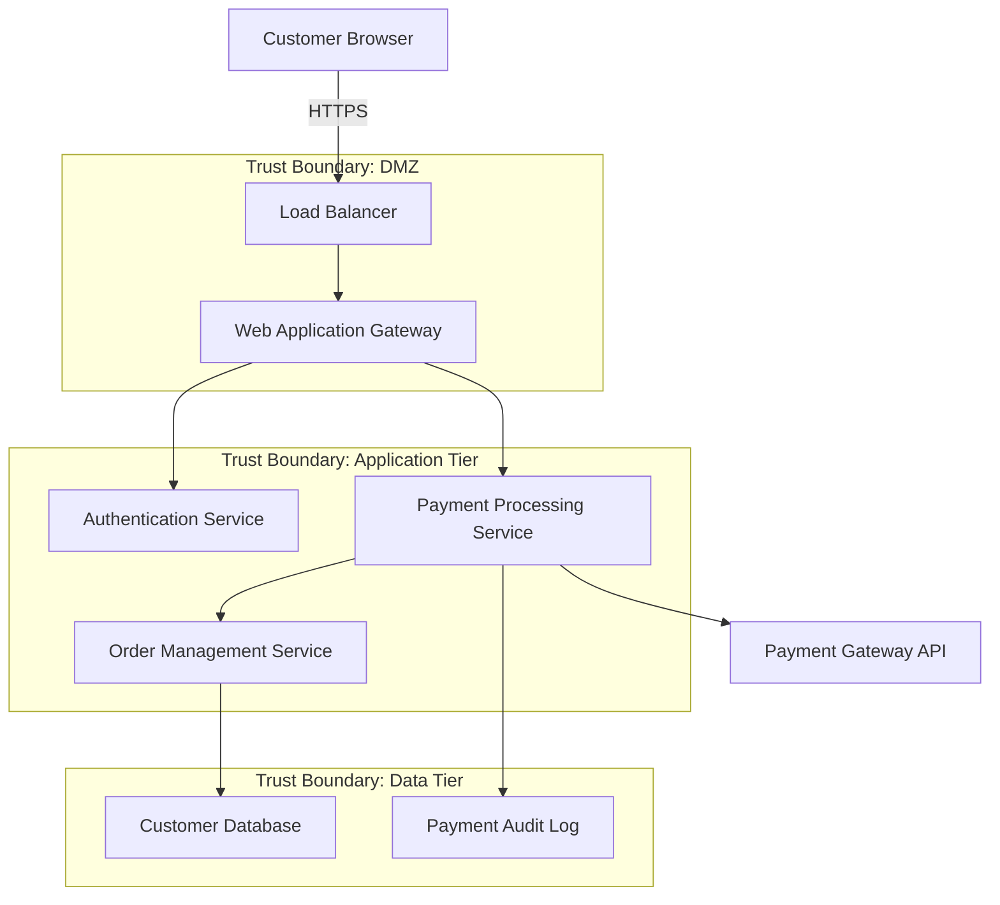

# Threat Modeling Integration Template

## Template Overview

This template provides a comprehensive framework for integrating threat modeling into development workflows, ensuring systematic identification of security threats and implementation of appropriate countermeasures throughout the software development lifecycle.

## Usage Context

Use this template when:
- Integrating threat modeling into agile development processes
- Conducting threat assessments for new features or architectural changes
- Updating threat models based on evolving attack landscapes
- Implementing security-by-design principles in development workflows
- Preparing for security architecture reviews and assessments

## Template Structure

### Threat Modeling Integration Context Setup

```
**Context**: Threat modeling integration for [PROJECT_NAME/SYSTEM_COMPONENT]

**System Characteristics and Scope**:
- Application type: [Web application, API, mobile app, IoT system, microservices]
- Architecture pattern: [Monolithic, microservices, serverless, hybrid]
- Deployment environment: [Cloud, on-premise, hybrid, edge computing]
- Data sensitivity: [Public, internal, confidential, regulated data types]
- User types: [End users, administrators, API consumers, third-party integrators]

**Threat Modeling Objectives**:
- Security requirements validation: [Confidentiality, integrity, availability goals]
- Attack surface analysis: [Entry points, trust boundaries, data flows]
- Threat identification: [STRIDE, PASTA, Attack Trees, Kill Chain analysis]
- Risk assessment: [Likelihood, impact, risk tolerance thresholds]
- Mitigation strategy: [Preventive, detective, corrective controls]

**Integration Requirements**:
- Development workflow: [Sprint planning, code review, CI/CD pipeline]
- Tool integration: [JIRA, Azure DevOps, GitHub, threat modeling tools]
- Documentation: [Architecture diagrams, security requirements, threat registry]
- Stakeholder involvement: [Security team, architects, product managers]
```

### Comprehensive Threat Modeling Framework

```
**Primary Threat Modeling Integration Request**: Conduct systematic threat analysis with the following structure:

1. **Asset and Data Flow Identification**:
   - Critical asset inventory with business value classification
   - Data flow mapping across system components and trust boundaries
   - External dependencies and third-party integration points
   - Privileged operations and administrative interfaces
   - Data storage locations and access patterns

2. **Attack Surface Analysis**:
   - Entry point enumeration and categorization
   - Trust boundary identification and validation
   - Authentication and authorization checkpoint mapping
   - Network communication pathway analysis
   - User interface and API endpoint security assessment

3. **Threat Identification and Classification**:
   - STRIDE methodology application (Spoofing, Tampering, Repudiation, Information Disclosure, Denial of Service, Elevation of Privilege)
   - OWASP Top 10 and industry-specific threat pattern analysis
   - Threat actor profiling and motivation assessment
   - Attack vector analysis and exploitation pathway mapping
   - Emerging threat landscape integration

4. **Risk Assessment and Prioritization**:
   - Likelihood assessment based on threat actor capability and opportunity
   - Impact analysis considering business consequences and technical damage
   - Risk matrix development with organizational risk tolerance alignment
   - Attack path analysis and multi-stage attack scenario modeling
   - Residual risk calculation after existing control implementation

5. **Mitigation Strategy Development**:
   - Preventive control identification and implementation planning
   - Detective control integration for threat monitoring and alerting
   - Corrective control design for incident response and recovery
   - Defense-in-depth strategy with layered security approach
   - Cost-benefit analysis for mitigation option selection

**System Architecture and Implementation**:
[PASTE_ARCHITECTURE_DIAGRAMS_AND_CODE_IMPLEMENTATION_HERE]

**Existing Security Controls**:
[PASTE_CURRENT_SECURITY_MEASURES_AND_CONFIGURATIONS_HERE]

**Threat Modeling Output Format**:
- Executive threat assessment summary with risk landscape overview
- Detailed threat inventory with STRIDE classification and risk ratings
- Attack scenario documentation with step-by-step exploitation paths
- Mitigation roadmap with prioritized security control recommendations
- Architecture security enhancement suggestions with implementation guidance
- Continuous threat monitoring recommendations with detection strategies
- Integration guidelines for development workflow and security processes
```

### Specialized Threat Modeling Modules

```
**Advanced Threat Modeling Modules** (select based on system characteristics):

**Cloud-Native Application Threat Modeling**:
- Container security threat analysis and runtime protection
- Kubernetes cluster security assessment and pod-to-pod communication
- Cloud service configuration threat evaluation and misconfiguration detection
- Serverless function security analysis and event-driven architecture threats
- Multi-cloud and hybrid environment threat boundary analysis

**API and Microservices Threat Modeling**:
- Service-to-service communication security and inter-service trust
- API gateway security assessment and rate limiting bypass scenarios
- Service mesh security evaluation and network policy validation
- Distributed authentication and authorization threat analysis
- Data consistency and eventual consistency security implications

**IoT and Edge Computing Threat Modeling**:
- Device firmware security assessment and update mechanism threats
- Edge-to-cloud communication security and data transmission protection
- Physical device access and tamper resistance evaluation
- Device provisioning and lifecycle management security analysis
- Network segmentation and isolation strategy for IoT deployments

**Mobile Application Threat Modeling**:
- Mobile platform-specific threat analysis (iOS, Android security models)
- Client-server communication security and certificate pinning assessment
- Local data storage security and encryption implementation validation
- Mobile device management (MDM) integration and policy enforcement
- App store security and distribution channel threat evaluation
```

## Implementation Examples

### Example 1: E-commerce Platform Threat Modeling

```
**Context**: Threat modeling integration for e-commerce platform payment processing component

**System Characteristics and Scope**:
- Application type: Web application with mobile app integration
- Architecture pattern: Microservices with event-driven communication
- Deployment environment: AWS cloud with multi-region distribution
- Data sensitivity: PCI DSS regulated payment data, customer PII
- User types: Customers, merchants, administrators, payment processors

**System Architecture for Threat Analysis**:


**Expected Threat Modeling Output**:

**🎯 Asset and Data Flow Analysis**
- **Critical Assets**: Payment card data (PCI DSS Level 1), customer credentials, order history
- **Data Flows**: Customer → Gateway → Payment Service → External Payment Processor
- **Trust Boundaries**: DMZ, Application Tier, Data Tier, External Integrations

**⚠️ High-Priority Threats Identified**

1. **T001: Payment Data Interception** (STRIDE: Information Disclosure)
   - **Threat Actor**: External attacker, malicious insider
   - **Attack Vector**: Man-in-the-middle, SSL/TLS downgrade, certificate spoofing
   - **Impact**: High (PCI DSS violation, financial loss, reputation damage)
   - **Likelihood**: Medium (sophisticated attack, but high-value target)
   - **Risk Rating**: High
   - **Mitigation Strategy**:
     - Implement certificate pinning in mobile applications
     - Use HTTP Strict Transport Security (HSTS) with long max-age
     - Deploy Certificate Transparency monitoring
     - Implement end-to-end encryption with tokenization

2. **T002: Authentication Bypass** (STRIDE: Spoofing, Elevation of Privilege)
   - **Threat Actor**: External attacker, account takeover specialist
   - **Attack Vector**: JWT manipulation, session fixation, credential stuffing
   - **Impact**: High (unauthorized access to payment functions)
   - **Likelihood**: Medium (common attack pattern, valuable target)
   - **Risk Rating**: High
   - **Mitigation Strategy**:
     - Implement robust JWT validation with short expiration
     - Deploy multi-factor authentication for payment operations
     - Use behavioral analytics for anomaly detection
     - Implement account lockout and rate limiting

3. **T003: Payment Processing Logic Tampering** (STRIDE: Tampering)
   - **Threat Actor**: Malicious insider, sophisticated external attacker
   - **Attack Vector**: Code injection, business logic bypass, race conditions
   - **Impact**: Critical (financial fraud, payment manipulation)
   - **Likelihood**: Low (requires system access or advanced skills)
   - **Risk Rating**: High
   - **Mitigation Strategy**:
     - Implement input validation and output encoding
     - Use parameterized queries and prepared statements
     - Deploy application-level firewalls with business logic rules
     - Implement atomic transactions with rollback capabilities

**🛡️ Recommended Security Controls**

```javascript
// Example: Enhanced payment processing with threat mitigation
class SecurePaymentProcessor {
    constructor(config) {
        this.validator = new InputValidator();
        this.authenticator = new StrongAuthenticator();
        this.auditLogger = new ComprehensiveAuditLogger();
        this.rateLimit = new AdvancedRateLimiter();
    }
    
    async processPayment(paymentRequest, userContext) {
        try {
            // T002 Mitigation: Strong authentication validation
            await this.authenticator.validateStrongAuth(userContext);
            
            // T002 Mitigation: Rate limiting for payment operations
            await this.rateLimit.checkPaymentRateLimit(userContext.userId);
            
            // T003 Mitigation: Comprehensive input validation
            const validatedRequest = await this.validator.validatePaymentRequest(paymentRequest);
            
            // T001 Mitigation: Tokenization before processing
            const tokenizedData = await this.tokenizePaymentData(validatedRequest);
            
            // T003 Mitigation: Atomic transaction processing
            const result = await this.executeAtomicPayment(tokenizedData, userContext);
            
            // Comprehensive audit logging for all threats
            await this.auditLogger.logPaymentProcessing({
                userId: userContext.userId,
                amount: validatedRequest.amount,
                transactionId: result.transactionId,
                timestamp: new Date().toISOString(),
                ipAddress: userContext.ipAddress,
                userAgent: userContext.userAgent
            });
            
            return result;
            
        } catch (error) {
            // T001, T002, T003 Mitigation: Secure error handling
            await this.auditLogger.logSecurityEvent({
                eventType: 'PAYMENT_PROCESSING_FAILURE',
                userId: userContext.userId,
                errorType: error.constructor.name,
                timestamp: new Date().toISOString()
            });
            
            throw new SecurePaymentError('Payment processing failed');
        }
    }
}
```

**📊 Risk Assessment Matrix**
- **Critical Risk (9-10)**: T003 - Payment Logic Tampering
- **High Risk (7-8)**: T001 - Data Interception, T002 - Authentication Bypass
- **Medium Risk (4-6)**: API rate limiting bypass, session management flaws
- **Low Risk (1-3)**: Information leakage through error messages
```

### Example 2: Healthcare Data Platform Threat Modeling

```
**Context**: Threat modeling for healthcare data analytics platform handling protected health information (PHI)

**System Characteristics and Scope**:
- Application type: Healthcare data analytics platform with ML capabilities
- Architecture pattern: Hybrid cloud with on-premise data processing
- Deployment environment: Azure cloud with HIPAA compliance requirements
- Data sensitivity: Protected Health Information (PHI), research data, clinical records
- User types: Healthcare providers, researchers, administrators, patients

**Specialized Healthcare Threat Analysis**:

**🏥 Healthcare-Specific Threat Scenarios**

1. **T101: PHI Data Breach** (STRIDE: Information Disclosure)
   - **Threat Actor**: Malicious insider, external cybercriminal, nation-state
   - **Attack Vector**: Database compromise, insider privilege abuse, ransomware
   - **Regulatory Impact**: HIPAA violations, OCR fines up to $1.5M per incident
   - **Patient Impact**: Privacy violation, identity theft, medical fraud
   - **Mitigation Strategy**:
     - Implement comprehensive data encryption at rest and in transit
     - Deploy data loss prevention (DLP) with PHI pattern recognition
     - Use attribute-based access control (ABAC) with patient consent validation
     - Implement database activity monitoring with real-time alerting

2. **T102: Medical Record Tampering** (STRIDE: Tampering, Repudiation)
   - **Threat Actor**: Malicious healthcare provider, insurance fraud perpetrator
   - **Attack Vector**: Database manipulation, audit log tampering, backup corruption
   - **Clinical Impact**: Incorrect treatment decisions, patient safety risks
   - **Legal Impact**: Malpractice liability, regulatory investigation
   - **Mitigation Strategy**:
     - Implement immutable audit trails with cryptographic integrity
     - Use blockchain-based medical record provenance tracking
     - Deploy real-time database change monitoring and approval workflows
     - Implement multi-party digital signatures for critical record changes

3. **T103: Research Data Poisoning** (STRIDE: Tampering, Denial of Service)
   - **Threat Actor**: Pharmaceutical competitor, malicious researcher
   - **Attack Vector**: ML model poisoning, dataset manipulation, algorithm bias injection
   - **Research Impact**: Invalid clinical insights, compromised drug development
   - **Regulatory Impact**: FDA submission integrity, clinical trial validity
   - **Mitigation Strategy**:
     - Implement federated learning with differential privacy
     - Use secure multi-party computation for collaborative research
     - Deploy ML model integrity monitoring and adversarial detection
     - Implement research data lineage tracking and version control

**🔒 HIPAA-Compliant Security Implementation**:
```python
# Healthcare-specific security controls implementation
class HIPAACompliantDataProcessor:
    def __init__(self, config):
        self.encryption_service = FIPSCompliantEncryption()
        self.access_control = PatientConsentABAC()
        self.audit_service = HIPAAAuditLogger()
        self.anonymization = AdvancedDeidentification()
    
    async def process_phi_data(self, patient_data, research_purpose, user_context):
        try:
            # Validate patient consent for specific research purpose
            consent_valid = await self.access_control.validate_consent(
                patient_data.patient_id, 
                research_purpose,
                user_context.researcher_id
            )
            
            if not consent_valid:
                raise ConsentViolationError("Patient consent not granted for this research purpose")
            
            # Apply de-identification before processing
            deidentified_data = await self.anonymization.safe_harbor_deidentification(
                patient_data,
                research_purpose.required_fields
            )
            
            # Process with differential privacy
            processed_result = await self.process_with_privacy_preservation(
                deidentified_data,
                privacy_budget=research_purpose.privacy_budget
            )
            
            # Comprehensive HIPAA audit logging
            await self.audit_service.log_phi_access({
                'patient_id': patient_data.patient_id,
                'researcher_id': user_context.researcher_id,
                'research_purpose': research_purpose.title,
                'data_fields_accessed': deidentified_data.field_list,
                'consent_reference': consent_valid.consent_id,
                'privacy_preserving_method': 'differential_privacy',
                'timestamp': datetime.now().isoformat()
            })
            
            return processed_result
            
        except Exception as error:
            # Secure error handling with HIPAA compliance
            await self.audit_service.log_security_incident({
                'incident_type': 'PHI_PROCESSING_FAILURE',
                'researcher_id': user_context.researcher_id,
                'error_category': self.classify_error(error),
                'patient_affected': patient_data.patient_id,
                'mitigation_applied': self.get_error_mitigation(error)
            })
            
            raise HIPAACompliantError("Data processing request could not be completed")
```
```

## Customization Guidelines

### Domain-Specific Adaptations

- **Financial Services**: Focus on fraud, money laundering, and regulatory compliance threats
- **Healthcare**: Emphasize patient privacy, data integrity, and clinical safety threats
- **Critical Infrastructure**: Prioritize availability, safety, and nation-state threat actors
- **SaaS Platforms**: Focus on multi-tenancy, data isolation, and supply chain threats

### Methodology Integration

- **STRIDE**: Systematic threat categorization for comprehensive coverage
- **PASTA**: Process-driven approach with business risk alignment
- **Attack Trees**: Hierarchical attack path analysis and defense optimization
- **OCTAVE**: Organizational risk-based approach with stakeholder involvement

## Integration with Development Tools

### Threat Modeling Tool Integration

```yaml
# Automated threat modeling pipeline
threat_modeling_pipeline:
  tools:
    - microsoft_threat_modeling: stride-based-analysis
    - owasp_threat_dragon: collaborative-threat-modeling
    - threagile: yaml-based-threat-modeling
    - pytm: python-threat-modeling-automation
  
  integration_points:
    - architecture_review: threat-model-updates-on-design-changes
    - code_review: threat-validation-in-pull-requests
    - security_testing: threat-driven-security-test-generation
    - incident_response: threat-model-updates-from-incidents
  
  automation:
    - threat_detection: automated-threat-identification-from-code
    - risk_calculation: dynamic-risk-scoring-based-on-changes
    - mitigation_tracking: security-control-implementation-monitoring
    - reporting: stakeholder-specific-threat-landscape-reports
```

### CI/CD Pipeline Integration

```python
# Threat modeling integration in CI/CD pipeline
class ThreatModelingCICD:
    def __init__(self, pipeline_config):
        self.threat_model_engine = ThreatModelingEngine()
        self.risk_calculator = RiskCalculator()
        self.mitigation_tracker = MitigationTracker()
        
    def integrate_threat_analysis(self, code_changes, architecture_updates):
        """Integrate threat modeling into CI/CD pipeline"""
        
        # Analyze code changes for new attack surfaces
        new_threats = self.threat_model_engine.analyze_code_changes(code_changes)
        
        # Update threat model based on architecture changes
        updated_threats = self.threat_model_engine.update_architecture_threats(
            architecture_updates
        )
        
        # Calculate risk impact of changes
        risk_assessment = self.risk_calculator.assess_change_risk(
            new_threats, updated_threats
        )
        
        # Check if existing mitigations cover new threats
        mitigation_gaps = self.mitigation_tracker.identify_coverage_gaps(
            new_threats, updated_threats
        )
        
        # Generate pipeline decision
        if risk_assessment.risk_level > self.pipeline_config.risk_threshold:
            return self.block_deployment_with_recommendations(
                risk_assessment, mitigation_gaps
            )
        else:
            return self.approve_with_monitoring_recommendations(
                risk_assessment, mitigation_gaps
            )
```

## Success Metrics and Effectiveness

### Threat Coverage Metrics

- **Threat Identification Rate**: Percentage of actual threats identified through modeling
- **Attack Surface Coverage**: Completeness of attack surface analysis and documentation
- **Threat Model Accuracy**: Alignment between modeled threats and real-world incidents
- **Mitigation Effectiveness**: Success rate of implemented countermeasures against identified threats

### Process Integration Indicators

- **Development Workflow Integration**: Seamless integration with existing development processes
- **Stakeholder Engagement**: Active participation from security, development, and business teams
- **Threat Model Maintenance**: Regular updates and evolution of threat models
- **Decision Support Quality**: Effectiveness of threat modeling in informing security decisions

### Business Impact Measurements

- **Security Incident Reduction**: Decrease in security incidents related to modeled threats
- **Compliance Improvement**: Enhanced compliance posture through systematic threat analysis
- **Cost Avoidance**: Financial impact of threats prevented through proactive modeling
- **Time to Market**: Impact on development velocity with integrated threat modeling

## Best Practices

### Threat Modeling Preparation

1. **Stakeholder Alignment**: Engage all relevant stakeholders in threat modeling process
2. **Asset Prioritization**: Focus modeling efforts on highest-value assets and systems
3. **Baseline Establishment**: Document current security posture before threat analysis
4. **Tool Selection**: Choose appropriate threat modeling tools for team and organization

### Threat Analysis Execution

1. **Systematic Approach**: Follow structured methodology consistently across projects
2. **Collaborative Process**: Involve diverse perspectives in threat identification
3. **Evidence-Based Analysis**: Support threat scenarios with concrete evidence and examples
4. **Risk-Based Prioritization**: Focus remediation efforts on highest-risk threats

### Continuous Improvement

1. **Regular Updates**: Keep threat models current with evolving systems and threat landscape
2. **Lessons Learned**: Incorporate insights from security incidents into threat models
3. **Metric Tracking**: Monitor effectiveness metrics and adjust approach accordingly
4. **Knowledge Sharing**: Share threat modeling insights across teams and projects

## Common Pitfalls and Solutions

### Analysis Paralysis

**Problem**: Over-analyzing threats without reaching actionable conclusions
**Solution**: Set time boundaries and focus on highest-impact threats first

### Threat Model Staleness

**Problem**: Threat models becoming outdated as systems evolve
**Solution**: Integrate threat model updates into change management processes

### Limited Stakeholder Engagement

**Problem**: Threat modeling conducted in isolation without business context
**Solution**: Establish cross-functional threat modeling teams with regular reviews

### Mitigation Implementation Gaps

**Problem**: Identifying threats without implementing appropriate countermeasures
**Solution**: Tie threat modeling directly to security backlog and sprint planning

## Advanced Optimization Strategies

### AI-Enhanced Threat Intelligence

- **Automated Threat Discovery**: AI-powered identification of new threat patterns
- **Attack Simulation**: ML-driven attack scenario generation and validation
- **Threat Prediction**: Predictive modeling of emerging threats based on system changes
- **Intelligence Integration**: Real-time threat intelligence integration into modeling process

### Continuous Threat Modeling

- **Real-Time Analysis**: Continuous threat assessment as code and architecture evolve
- **Dynamic Risk Scoring**: Real-time risk calculation based on current threat landscape
- **Automated Mitigation**: AI-suggested countermeasures for newly identified threats
- **Adaptive Security**: Security controls that adapt based on evolving threat models

### Ecosystem Integration

- **Industry Collaboration**: Sharing anonymized threat intelligence across industry
- **Regulatory Integration**: Aligning threat models with regulatory requirements and guidance
- **Vendor Risk Assessment**: Extending threat modeling to third-party and supply chain risks
- **Community Contribution**: Contributing threat patterns and mitigations to security community