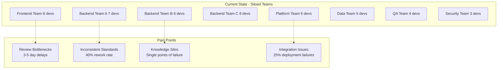

# Cross-Team Collaboration Optimization Template

## Template Overview

This template provides a systematic framework for optimizing knowledge sharing and collaboration between development teams, establishing efficient review processes, and creating sustainable cross-team learning mechanisms.

## Usage Context

Use this template when:
- Coordinating code reviews across multiple development teams
- Establishing knowledge sharing protocols for distributed teams
- Optimizing collaboration between frontend, backend, and platform teams
- Facilitating knowledge transfer during team restructuring or scaling
- Creating cross-functional expertise and reducing knowledge silos

## Template Structure

### Cross-Team Collaboration Context Setup

```
**Context**: Cross-team collaboration optimization for {ORGANIZATION_NAME}

**Team Structure and Scope**:
- Team composition: {TEAM_DETAILS} (team sizes, expertise areas, geographic distribution)
- Collaboration scope: {COLLABORATION_AREAS} (shared codebases, integrated systems, common standards)
- Current challenges: {CURRENT_ISSUES} (communication gaps, knowledge silos, review bottlenecks)
- Organization scale: {SCALE_METRICS} (number of teams, developers, repositories, shared components)
- Technology landscape: {TECH_ECOSYSTEM} (shared technologies, platform dependencies, integration points)

**Collaboration Objectives**:
- Knowledge sharing goals: {SHARING_OBJECTIVES} (expertise distribution, skill development, standard adoption)
- Efficiency targets: {EFFICIENCY_GOALS} (review time reduction, collaboration overhead minimization)
- Quality standards: {QUALITY_TARGETS} (consistency improvement, best practice adoption, error reduction)
- Innovation objectives: {INNOVATION_GOALS} (cross-pollination of ideas, solution sharing, collective problem-solving)
- Cultural alignment: {CULTURE_GOALS} (unified practices, shared ownership, collaborative mindset)

**Organizational Context**:
- Development methodology: {METHODOLOGY} (agile, scrum, kanban, continuous delivery)
- Review processes: {CURRENT_PROCESSES} (existing review workflows, approval mechanisms, quality gates)
- Communication tools: {COMMUNICATION_STACK} (Slack, Teams, Confluence, GitHub, GitLab)
- Knowledge management: {KNOWLEDGE_SYSTEMS} (wikis, documentation platforms, training programs)
- Success metrics: {SUCCESS_CRITERIA} (collaboration KPIs, productivity measures, quality indicators)
```

### Comprehensive Collaboration Optimization Framework

```
**Primary Collaboration Optimization Request**: Establish systematic cross-team collaboration across the following dimensions:

1. **Knowledge Sharing Architecture and Strategy**:
   - Cross-team expertise mapping and skill distribution analysis
   - Knowledge gap identification and strategic expertise development planning
   - Information flow optimization and communication channel streamlining
   - Collaborative decision-making framework and consensus-building processes
   - Knowledge repository organization and accessibility improvement

2. **Review Process Standardization and Efficiency**:
   - Cross-team review workflow design and implementation
   - Review assignment algorithms and expertise-based routing
   - Quality gate standardization and consistent approval criteria
   - Review feedback aggregation and conflict resolution mechanisms
   - Performance metrics tracking and continuous process improvement

3. **Collaborative Development Practices and Standards**:
   - Shared coding standards and architectural guideline development
   - Cross-team pair programming and knowledge transfer sessions
   - Collaborative design review and architecture decision processes
   - Joint problem-solving frameworks and escalation procedures
   - Innovation sharing and best practice propagation mechanisms

4. **Communication and Coordination Optimization**:
   - Communication protocol establishment and tool integration
   - Meeting efficiency optimization and decision documentation
   - Asynchronous collaboration framework and time zone accommodation
   - Conflict resolution and consensus-building process design
   - Status transparency and progress visibility improvement

5. **Learning and Development Integration**:
   - Cross-team mentorship program design and implementation
   - Joint training initiative planning and skill development coordination
   - Knowledge exchange session organization and facilitation
   - Cross-functional project assignment and rotation opportunities
   - Collaborative innovation challenges and hackathon organization

**Current Collaboration State and Challenges**:
{PASTE_CURRENT_COLLABORATION_ANALYSIS_HERE}

**Team Structure and Expertise Mapping**:
{PASTE_TEAM_COMPOSITION_AND_SKILLS_ANALYSIS_HERE}

**Collaboration Optimization Output Format**:
- Executive collaboration assessment with optimization opportunities and ROI projections
- Detailed cross-team workflow design with process documentation and implementation guidelines
- Knowledge sharing strategy with specific initiatives and success metrics
- Communication optimization plan with tool integration and protocol establishment
- Performance measurement framework with KPIs and continuous improvement processes
- Team development program with cross-functional learning objectives and career development paths
- Implementation roadmap with phased rollout and change management considerations
```

### Specialized Collaboration Modules

```
**Advanced Collaboration Modules** (select based on organizational structure and needs):

**Distributed Team Collaboration Optimization**:
- Time zone-aware collaboration scheduling and asynchronous workflow design
- Remote pair programming and collaborative development tool integration
- Cultural bridge-building and communication style adaptation strategies
- Digital workspace optimization and virtual presence enhancement
- Remote onboarding and knowledge transfer process refinement

**Large-Scale Organization Collaboration**:
- Enterprise-level knowledge management and searchable expertise directory
- Scalable review process automation and intelligent assignment systems
- Cross-division collaboration framework and resource sharing protocols
- Corporate learning and development integration with collaborative skill building
- Strategic alignment and top-down collaboration initiative coordination

**Product Team Collaboration Optimization**:
- Cross-functional product development workflow and stakeholder coordination
- User experience and technical implementation collaboration frameworks
- Product roadmap alignment and technical feasibility collaboration
- Customer feedback integration and cross-team response coordination
- Product quality assurance and collaborative testing strategies

**Platform and Infrastructure Team Collaboration**:
- Shared platform development and API collaboration standards
- Infrastructure change coordination and impact assessment processes
- DevOps and development team collaboration optimization
- Security and compliance collaborative review and implementation
- Performance and reliability shared responsibility frameworks
```

## Implementation Examples

### Example 1: Multi-Team Microservices Collaboration Optimization

```
**Context**: Cross-team collaboration optimization for microservices architecture with 8 development teams

**Team Structure and Scope**:
- Team composition: 8 teams (6-8 developers each), Frontend, Backend, Platform, Data, QA, Security
- Collaboration scope: 45 microservices, shared libraries, common infrastructure, API standards
- Current challenges: Review bottlenecks, inconsistent standards, knowledge silos, integration issues
- Organization scale: 50+ developers, 200+ repositories, 15+ shared components
- Technology landscape: Node.js, React, PostgreSQL, Redis, Kubernetes, AWS

**Current Collaboration Analysis**:


**Expected Collaboration Optimization Output**:

## Cross-Team Collaboration Optimization Report

### Executive Assessment

**Current Collaboration Efficiency**: 45% (significant optimization opportunities identified)

**Key Optimization Opportunities**:
- **Review Process Streamlining**: 60% reduction in review cycle time potential
- **Knowledge Sharing Enhancement**: 70% improvement in cross-team expertise availability
- **Standard Unification**: 50% reduction in rework through consistent practices
- **Integration Reliability**: 80% improvement in deployment success rates

**ROI Projections**:
- **Development Velocity**: 40% increase in feature delivery speed
- **Quality Improvement**: 55% reduction in post-deployment issues
- **Cost Optimization**: $300K annual savings through efficiency gains
- **Team Satisfaction**: 35% improvement in developer experience and collaboration satisfaction

### Detailed Cross-Team Workflow Design

**1. Intelligent Review Assignment System**

```javascript
// Automated review assignment based on expertise and workload
class CrossTeamReviewAssigner {
  constructor(teamConfig, expertiseMatrix, workloadTracker) {
    this.teams = teamConfig;
    this.expertise = expertiseMatrix;
    this.workload = workloadTracker;
    this.reviewHistory = new Map();
  }
  
  assignReviewers(pullRequest) {
    const requiredExpertise = this.analyzeRequiredExpertise(pullRequest);
    const optimalReviewers = this.findOptimalReviewers(requiredExpertise);
    
    return {
      primaryReviewer: optimalReviewers.primary,
      secondaryReviewers: optimalReviewers.secondary,
      expertConsultants: optimalReviewers.experts,
      estimatedReviewTime: this.estimateReviewTime(pullRequest, optimalReviewers),
      escalationPath: this.defineEscalationPath(requiredExpertise)
    };
  }
  
  analyzeRequiredExpertise(pullRequest) {
    const changedFiles = pullRequest.changedFiles;
    const expertise = new Set();
    
    // Analyze file patterns to determine required expertise
    changedFiles.forEach(file => {
      if (file.path.includes('/api/')) expertise.add('backend-api');
      if (file.path.includes('/components/')) expertise.add('frontend-react');
      if (file.path.includes('/database/')) expertise.add('database-design');
      if (file.path.includes('/infrastructure/')) expertise.add('platform-devops');
      if (file.path.includes('security')) expertise.add('security-review');
      if (file.path.includes('.test.')) expertise.add('testing-qa');
    });
    
    // Analyze complexity and impact
    const complexity = this.assessComplexity(pullRequest);
    const impact = this.assessImpact(pullRequest);
    
    return {
      requiredSkills: Array.from(expertise),
      complexityLevel: complexity,
      impactLevel: impact,
      reviewDepth: this.determineReviewDepth(complexity, impact)
    };
  }
  
  findOptimalReviewers(requiredExpertise) {
    const availableReviewers = this.getAvailableReviewers();
    const rankedReviewers = [];
    
    availableReviewers.forEach(reviewer => {
      const score = this.calculateReviewerScore(reviewer, requiredExpertise);
      rankedReviewers.push({ reviewer, score });
    });
    
    rankedReviewers.sort((a, b) => b.score - a.score);
    
    return {
      primary: rankedReviewers[0]?.reviewer,
      secondary: rankedReviewers.slice(1, 3).map(r => r.reviewer),
      experts: this.findSubjectMatterExperts(requiredExpertise.requiredSkills)
    };
  }
  
  calculateReviewerScore(reviewer, requiredExpertise) {
    let score = 0;
    
    // Expertise matching
    requiredExpertise.requiredSkills.forEach(skill => {
      if (reviewer.expertise.includes(skill)) {
        score += reviewer.expertiseLevel[skill] * 10;
      }
    });
    
    // Workload consideration
    const currentWorkload = this.workload.getCurrentWorkload(reviewer.id);
    score -= currentWorkload * 2;
    
    // Historical performance
    const reviewQuality = this.getHistoricalReviewQuality(reviewer.id);
    score += reviewQuality * 5;
    
    // Team diversity bonus
    if (this.promotesTeamDiversity(reviewer, requiredExpertise)) {
      score += 15;
    }
    
    return score;
  }
}

// Cross-team expertise matrix
const expertiseMatrix = {
  teams: {
    frontend: {
      members: ['alice', 'bob', 'charlie'],
      expertise: ['react', 'typescript', 'css', 'performance', 'accessibility'],
      crossTraining: ['api-integration', 'testing']
    },
    backend_a: {
      members: ['david', 'eve', 'frank'],
      expertise: ['nodejs', 'express', 'postgresql', 'redis', 'api-design'],
      crossTraining: ['security', 'performance']
    },
    platform: {
      members: ['grace', 'henry', 'iris'],
      expertise: ['kubernetes', 'aws', 'docker', 'monitoring', 'ci-cd'],
      crossTraining: ['security', 'database']
    },
    security: {
      members: ['jack', 'kate'],
      expertise: ['security-review', 'penetration-testing', 'compliance'],
      crossTraining: ['backend', 'platform']
    }
  },
  
  collaborationMatrix: {
    'frontend-backend': {
      commonReviews: ['api-integration', 'data-flow', 'error-handling'],
      sharedStandards: ['typescript', 'error-codes', 'api-contracts']
    },
    'backend-platform': {
      commonReviews: ['deployment', 'configuration', 'monitoring', 'scaling'],
      sharedStandards: ['logging', 'metrics', 'health-checks']
    },
    'security-all': {
      commonReviews: ['authentication', 'authorization', 'data-protection'],
      sharedStandards: ['security-headers', 'input-validation', 'audit-logging']
    }
  }
};
```

**2. Knowledge Sharing Strategy Implementation**

```javascript
// Cross-team knowledge sharing platform
class KnowledgeSharingPlatform {
  constructor(teamStructure, learningObjectives) {
    this.teams = teamStructure;
    this.objectives = learningObjectives;
    this.knowledgeGraph = new Map();
    this.sharingActivities = [];
  }
  
  createKnowledgeSharingPlan() {
    return {
      expertiseGapAnalysis: this.analyzeExpertiseGaps(),
      knowledgeTransferSessions: this.planTransferSessions(),
      crossTeamMentorship: this.establishMentorshipProgram(),
      collaborativeProjects: this.identifyCollaborationOpportunities(),
      measurementFramework: this.createMeasurementFramework()
    };
  }
  
  analyzeExpertiseGaps() {
    const gaps = [];
    
    this.teams.forEach(team => {
      const requiredSkills = this.getRequiredSkills(team);
      const currentSkills = this.getCurrentSkills(team);
      
      const missingSkills = requiredSkills.filter(skill => 
        !currentSkills.some(current => current.skill === skill && current.level >= 3)
      );
      
      gaps.push({
        team: team.name,
        missingSkills: missingSkills,
        riskLevel: this.assessRiskLevel(missingSkills),
        transferOpportunities: this.findTransferOpportunities(missingSkills)
      });
    });
    
    return gaps;
  }
  
  planTransferSessions() {
    const sessions = [];
    
    // Regular knowledge sharing sessions
    sessions.push({
      type: 'tech-talks',
      frequency: 'weekly',
      duration: '45 minutes',
      format: 'presentation + Q&A',
      topics: this.generateTechTalkTopics(),
      rotatingPresenter: true
    });
    
    // Deep dive workshops
    sessions.push({
      type: 'workshops',
      frequency: 'monthly',
      duration: '2 hours',
      format: 'hands-on coding',
      topics: this.generateWorkshopTopics(),
      expertLed: true
    });
    
    // Cross-team pair programming
    sessions.push({
      type: 'pair-programming',
      frequency: 'bi-weekly',
      duration: '2 hours',
      format: 'collaborative coding',
      pairings: this.generateOptimalPairings(),
      objectives: this.definePairProgrammingObjectives()
    });
    
    return sessions;
  }
  
  establishMentorshipProgram() {
    const mentorshipPairs = [];
    
    // Cross-team expertise mentoring
    this.teams.forEach(menteeTeam => {
      const expertiseNeeds = this.getExpertiseNeeds(menteeTeam);
      
      expertiseNeeds.forEach(need => {
        const mentor = this.findBestMentor(need, menteeTeam);
        const mentee = this.findBestMentee(need, menteeTeam);
        
        if (mentor && mentee) {
          mentorshipPairs.push({
            mentor: mentor,
            mentee: mentee,
            skillArea: need,
            duration: '3 months',
            objectives: this.defineMentorshipObjectives(need),
            schedule: this.createMentorshipSchedule(),
            successMetrics: this.defineMentorshipMetrics(need)
          });
        }
      });
    });
    
    return {
      pairs: mentorshipPairs,
      program_structure: this.createMentorshipStructure(),
      support_resources: this.createMentorshipResources(),
      evaluation_framework: this.createMentorshipEvaluation()
    };
  }
}

// Implementation of cross-team collaboration protocols
const collaborationProtocols = {
  communicationStandards: {
    syncMeetings: {
      dailyStandups: {
        format: 'async-first with sync option',
        duration: '15 minutes max',
        cross_team_representation: 'rotating attendance'
      },
      
      planningMeetings: {
        cross_team_planning: 'monthly alignment sessions',
        dependency_review: 'bi-weekly coordination',
        architecture_review: 'quarterly deep dives'
      }
    },
    
    asyncCommunication: {
      threaded_discussions: 'topic-based channels with clear threading',
      decision_documentation: 'ADR (Architecture Decision Records) for major decisions',
      status_updates: 'automated dashboard with manual highlights'
    }
  },
  
  reviewStandards: {
    cross_team_reviews: {
      required_reviewers: 'minimum 1 from owning team + 1 from affected team',
      review_checklist: 'standardized checklist with team-specific additions',
      approval_criteria: 'explicit approval from each affected team lead'
    },
    
    escalation_process: {
      technical_disputes: 'architecture council review within 48 hours',
      timeline_conflicts: 'product and engineering lead coordination',
      resource_constraints: 'management escalation with data-driven proposals'
    }
  }
};
```

### Implementation Roadmap

**Phase 1: Foundation (Weeks 1-4)**
1. **Team Mapping and Analysis**
   - Complete expertise mapping across all teams
   - Identify critical knowledge gaps and single points of failure
   - Establish baseline collaboration metrics

2. **Tool Integration and Process Design**
   - Implement intelligent review assignment system
   - Set up cross-team communication channels
   - Create standardized review templates and checklists

3. **Initial Knowledge Sharing Programs**
   - Launch weekly tech talks with rotating presenters
   - Begin cross-team pair programming sessions
   - Establish mentorship program pilot

**Phase 2: Optimization (Weeks 5-12)**
1. **Process Refinement**
   - Optimize review assignment algorithms based on initial data
   - Refine communication protocols based on team feedback
   - Enhance knowledge sharing formats and content

2. **Expanded Collaboration**
   - Implement cross-team project assignments
   - Launch collaborative innovation challenges
   - Establish cross-functional design review processes

3. **Measurement and Improvement**
   - Implement comprehensive metrics tracking
   - Conduct mid-phase collaboration assessment
   - Adjust strategies based on performance data

**Phase 3: Scaling and Sustainability (Weeks 13-24)**
1. **Organization-Wide Rollout**
   - Extend successful practices to all teams
   - Create self-sustaining knowledge sharing communities
   - Implement automated collaboration health monitoring

2. **Advanced Collaboration Features**
   - Deploy AI-powered collaboration recommendations
   - Implement predictive collaboration analytics
   - Create adaptive collaboration processes

3. **Long-term Sustainability**
   - Establish collaboration governance framework
   - Create succession planning for key collaboration roles
   - Implement continuous improvement processes

### Success Metrics and Evaluation

**Collaboration Efficiency Metrics**:
- **Review Cycle Time**: Target 50% reduction (from 3.2 days to 1.6 days average)
- **Cross-Team Integration**: 80% improvement in deployment success rate
- **Knowledge Transfer Rate**: 70% improvement in skill distribution across teams
- **Communication Effectiveness**: 60% reduction in miscommunication incidents

**Quality and Innovation Indicators**:
- **Code Quality Consistency**: 45% improvement in cross-team code quality scores
- **Innovation Metrics**: 3x increase in cross-team solution sharing
- **Problem Resolution Speed**: 65% faster resolution of cross-team technical issues
- **Best Practice Adoption**: 80% adoption rate of shared standards and practices

**Team Development and Satisfaction**:
- **Skill Development**: 55% improvement in cross-functional capabilities
- **Collaboration Satisfaction**: 40% improvement in team collaboration ratings
- **Knowledge Confidence**: 70% improvement in comfort with cross-team contributions
- **Career Development**: 85% of participants report improved career growth opportunities
```

### Example 2: Remote-First Cross-Team Collaboration Optimization

```
**Context**: Collaboration optimization for distributed teams across 4 time zones with remote-first culture

**Team Structure and Scope**:
- Team composition: 6 teams distributed across US West Coast, US East Coast, Europe, Asia-Pacific
- Collaboration scope: Shared platform development, API standards, cross-regional feature delivery
- Current challenges: Time zone coordination, asynchronous communication gaps, cultural differences
- Organization scale: 35 developers, 3 major products, 12-hour maximum time zone spread
- Technology landscape: Remote-first tooling, async-heavy workflows, global infrastructure

**Expected Collaboration Optimization Output**:

## Remote-First Collaboration Optimization Strategy

### Time Zone-Aware Collaboration Framework

**Asynchronous-First Design Principles**:
```javascript
// Async collaboration workflow manager
class AsyncCollaborationManager {
  constructor(timeZoneConfig, teamAvailability) {
    this.timeZones = timeZoneConfig;
    this.availability = teamAvailability;
    this.handoffProtocols = new Map();
  }
  
  optimizeCollaborationSchedule(collaborationRequest) {
    const participants = collaborationRequest.participants;
    const urgency = collaborationRequest.urgency;
    const complexity = collaborationRequest.complexity;
    
    if (urgency === 'high' && this.hasOverlap(participants)) {
      return this.scheduleSyncSession(participants);
    } else {
      return this.createAsyncWorkflow(participants, complexity);
    }
  }
  
  createAsyncWorkflow(participants, complexity) {
    const workflow = {
      phases: this.createTimeZonePhases(participants),
      handoffs: this.designHandoffProtocols(participants),
      documentation: this.defineDocumentationRequirements(complexity),
      checkpoints: this.createProgressCheckpoints(participants),
      escalation: this.defineAsyncEscalationPaths(participants)
    };
    
    return workflow;
  }
  
  createTimeZonePhases(participants) {
    // Create working phases that leverage each time zone's strengths
    return [
      {
        timezone: 'APAC',
        focus: 'implementation and initial review',
        handoffTo: 'Europe',
        deliverables: ['code changes', 'initial test results', 'design questions']
      },
      {
        timezone: 'Europe', 
        focus: 'architectural review and optimization',
        handoffTo: 'US East',
        deliverables: ['architecture feedback', 'optimization suggestions', 'integration concerns']
      },
      {
        timezone: 'US East',
        focus: 'business logic validation and stakeholder review',
        handoffTo: 'US West',
        deliverables: ['business validation', 'stakeholder feedback', 'requirement clarifications']
      },
      {
        timezone: 'US West',
        focus: 'final integration and deployment preparation',
        handoffTo: 'APAC',
        deliverables: ['integration testing', 'deployment plan', 'next iteration planning']
      }
    ];
  }
}
```

**Cultural Bridge-Building Strategies**:
- **Communication Style Adaptation**: Training on direct vs indirect communication preferences
- **Cultural Awareness Programs**: Regular sessions on cultural differences and best practices
- **Inclusive Meeting Practices**: Rotating meeting times and async alternatives
- **Documentation Standards**: Clear, context-rich documentation for cross-cultural understanding

**Remote Collaboration Tools Optimization**:
```yaml
# Remote collaboration tool stack
collaboration_tools:
  async_communication:
    - threaded_discussions: slack_with_mandatory_threading
    - decision_recording: notion_with_decision_templates
    - status_updates: automated_dashboard_with_manual_highlights
    - knowledge_sharing: confluence_with_search_optimization
  
  sync_communication:
    - video_meetings: zoom_with_recording_transcription
    - collaborative_editing: figma_google_docs_real_time
    - screen_sharing: high_quality_low_latency_solutions
    - whiteboarding: miro_with_template_library
  
  code_collaboration:
    - review_tools: github_with_async_review_templates
    - pair_programming: vscode_live_share_with_time_zone_scheduling
    - architecture_discussions: lucidchart_with_collaborative_editing
    - knowledge_capture: gitbook_with_team_contribution_workflows
```

### Expected Outcomes

**Collaboration Efficiency Improvements**:
- **Time Zone Utilization**: 24-hour development cycle with 90% effective handoffs
- **Communication Quality**: 65% improvement in cross-cultural communication effectiveness
- **Decision Speed**: 50% faster decision-making through structured async processes
- **Knowledge Retention**: 80% improvement in knowledge preservation across handoffs

**Team Satisfaction and Performance**:
- **Work-Life Balance**: 45% improvement in global team work-life balance scores
- **Inclusion Metrics**: 70% improvement in team inclusion and belonging scores
- **Productivity**: 35% increase in cross-team feature delivery velocity
- **Innovation**: 60% increase in cross-regional idea sharing and implementation
```

## Customization Guidelines

### Organization Size Adaptations

- **Small Organizations (2-5 teams)**: Focus on informal knowledge sharing and direct collaboration
- **Medium Organizations (6-15 teams)**: Implement structured processes with moderate automation
- **Large Organizations (16+ teams)**: Deploy comprehensive automation and governance frameworks
- **Enterprise Scale**: Include compliance, security, and formal governance requirements

### Geographic Distribution Modifications

- **Co-located Teams**: Emphasize face-to-face collaboration and real-time interaction
- **Regional Distribution**: Balance sync and async collaboration with cultural considerations
- **Global Distribution**: Prioritize async-first processes with strategic sync touchpoints
- **Hybrid Models**: Flexible frameworks accommodating both remote and co-located team members

## Integration with Collaboration Platforms

### Automated Collaboration Analytics

```yaml
# Collaboration analytics and optimization
collaboration_analytics:
  real_time_metrics:
    - communication_efficiency: response_time_and_thread_completion_analysis
    - knowledge_sharing_velocity: expertise_distribution_and_adoption_tracking
    - collaboration_quality: team_satisfaction_and_outcome_measurement
    - cross_team_integration: dependency_resolution_and_delivery_success_rates
  
  predictive_optimization:
    - collaboration_bottleneck_prediction: ml_powered_workflow_optimization
    - expertise_gap_forecasting: skill_development_need_prediction
    - team_formation_optimization: project_based_team_composition_recommendations
    - communication_pattern_analysis: optimal_interaction_frequency_and_format_suggestions
```

### Knowledge Management Integration

```python
# Comprehensive collaboration management platform
class CollaborationOptimizationPlatform:
    def __init__(self, org_structure, collaboration_goals):
        self.organization = org_structure
        self.goals = collaboration_goals
        self.analytics_engine = CollaborationAnalytics()
        self.optimization_engine = CollaborationOptimizer()
        self.knowledge_manager = CrossTeamKnowledgeManager()
        
    def optimize_cross_team_collaboration(self):
        """Comprehensive collaboration optimization process"""
        
        # Analyze current collaboration state
        collaboration_analysis = self.analytics_engine.analyze_current_state(
            self.organization.teams,
            self.organization.communication_patterns,
            self.organization.knowledge_flows
        )
        
        # Generate optimization recommendations
        optimization_plan = self.optimization_engine.create_optimization_plan(
            collaboration_analysis,
            self.goals,
            self.organization.constraints
        )
        
        # Implement knowledge sharing initiatives
        knowledge_initiatives = self.knowledge_manager.design_sharing_programs(
            collaboration_analysis.knowledge_gaps,
            optimization_plan.learning_objectives
        )
        
        return {
            'collaboration_assessment': collaboration_analysis,
            'optimization_roadmap': optimization_plan,
            'knowledge_programs': knowledge_initiatives,
            'success_measurement': self.create_measurement_framework(),
            'implementation_support': self.create_change_management_plan()
        }
    
    def monitor_collaboration_effectiveness(self, implemented_changes):
        """Continuous monitoring and improvement of collaboration"""
        
        return {
            'efficiency_metrics': self.measure_collaboration_efficiency(implemented_changes),
            'quality_indicators': self.assess_collaboration_quality(implemented_changes),
            'satisfaction_analysis': self.measure_team_satisfaction(implemented_changes),
            'improvement_opportunities': self.identify_optimization_opportunities(implemented_changes)
        }
```

## Success Metrics and Effectiveness

### Collaboration Quality Indicators

- **Communication Effectiveness**: Reduction in miscommunication incidents and improved clarity
- **Knowledge Transfer Success**: Measurable improvement in cross-team expertise and capability
- **Decision-Making Efficiency**: Faster consensus building and reduced decision bottlenecks
- **Conflict Resolution**: Improved ability to resolve cross-team conflicts constructively

### Productivity and Innovation Impact

- **Cross-Team Delivery Velocity**: Faster delivery of features requiring multiple team collaboration
- **Innovation Rate**: Increased rate of cross-team solution sharing and collaborative innovation
- **Quality Improvement**: Better outcomes through diverse perspectives and expertise combination
- **Risk Reduction**: Decreased risk through distributed knowledge and collaborative oversight

### Organizational Benefits

- **Scalability**: Improved ability to scale teams and maintain collaboration effectiveness
- **Resilience**: Reduced single points of failure through knowledge distribution
- **Adaptability**: Enhanced organizational ability to adapt to change through collaborative learning
- **Culture Enhancement**: Stronger collaborative culture and shared ownership mindset

## Best Practices

### Collaboration Design Principles

1. **Async-First Approach**: Design collaboration processes to work asynchronously by default
2. **Clear Communication Protocols**: Establish explicit guidelines for cross-team communication
3. **Shared Ownership**: Foster collective responsibility for shared components and outcomes
4. **Continuous Learning**: Embed learning and knowledge sharing into regular collaboration

### Implementation Strategy

1. **Gradual Rollout**: Implement collaboration improvements incrementally with pilot programs
2. **Feedback Integration**: Continuously gather and integrate feedback from all participating teams
3. **Tool Optimization**: Regularly assess and optimize collaboration tools and processes
4. **Culture Development**: Actively cultivate collaborative culture through recognition and incentives

### Sustainability and Evolution

1. **Process Documentation**: Maintain clear documentation of collaboration processes and decisions
2. **Regular Assessment**: Conduct periodic reviews of collaboration effectiveness and satisfaction
3. **Adaptation Capability**: Build flexibility into collaboration frameworks for ongoing evolution
4. **Leadership Support**: Ensure ongoing leadership support and resource allocation for collaboration

## Common Pitfalls and Solutions

### Collaboration Overhead

**Problem**: Excessive coordination overhead reducing individual team productivity
**Solution**: Balance collaboration needs with team autonomy and implement efficient coordination mechanisms

### Communication Fatigue

**Problem**: Team members overwhelmed by cross-team communication requirements
**Solution**: Prioritize essential communication and implement async-first approaches to reduce meeting load

### Cultural Misalignment

**Problem**: Different team cultures creating friction in collaboration
**Solution**: Invest in cultural awareness training and establish shared collaboration norms

### Tool Proliferation

**Problem**: Too many collaboration tools creating confusion and inefficiency
**Solution**: Standardize on core collaboration tools and provide clear usage guidelines

## Advanced Collaboration Strategies

### AI-Enhanced Collaboration

- **Intelligent Meeting Scheduling**: AI optimization of cross-team meeting times and formats
- **Automated Knowledge Matching**: AI-powered matching of knowledge needs with expertise
- **Collaboration Pattern Analysis**: Machine learning insights into effective collaboration patterns
- **Predictive Conflict Resolution**: AI identification of potential collaboration conflicts before they escalate

### Dynamic Team Formation

- **Project-Based Collaboration**: Flexible team formation based on project requirements and expertise
- **Cross-Functional Squads**: Temporary multi-team formations for specific initiatives
- **Expertise Networks**: Dynamic networks of subject matter experts across organizational boundaries
- **Collaborative Innovation Labs**: Dedicated spaces and processes for cross-team innovation

### Continuous Collaboration Evolution

- **Real-Time Adaptation**: Collaboration processes that adapt based on ongoing performance data
- **Crowd-Sourced Improvement**: Team-driven optimization of collaboration practices
- **External Benchmarking**: Regular comparison with industry best practices and external organizations
- **Future-Proofing**: Collaboration frameworks designed to evolve with organizational growth and change