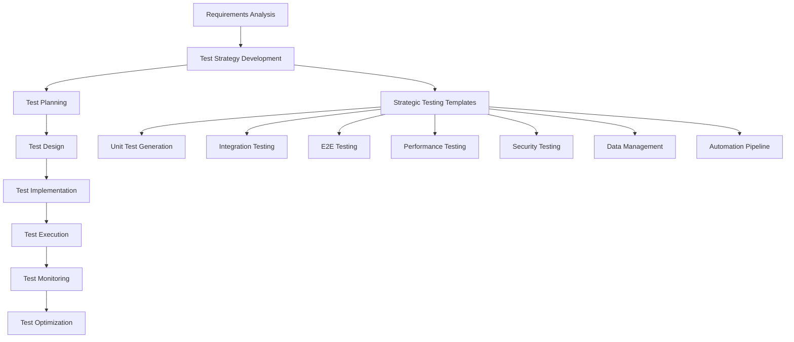

# Template Effectiveness Metrics and Coverage Analysis

## Overview

This document provides comprehensive metrics for measuring the effectiveness of strategic testing templates, analyzing coverage completeness, and validating the return on investment for AI-assisted testing strategies. These metrics enable teams to quantify improvement and optimize template usage.

## Usage Context

Use this metrics framework when:
- Measuring template effectiveness and ROI across testing initiatives
- Analyzing coverage completeness for strategic testing template libraries  
- Validating improvement metrics and time savings from AI-assisted testing
- Establishing baseline measurements for testing strategy optimization

## Template Coverage Analysis

### Comprehensive Template Matrix

| Template Category | Templates Count | Coverage Scope | Complexity Level | Time Savings |
|-------------------|-----------------|----------------|------------------|--------------|
| **Test Strategy Development** | 3 | Strategic Planning | Intermediate | 70-85% |
| **Unit Test Generation** | 3 | Code-Level Testing | Advanced | 70-85% |
| **Integration Test Planning** | 3 | System Integration | Advanced | 70-85% |
| **End-to-End Test Scenarios** | 3 | User Journey Testing | Intermediate | 65-80% |
| **Performance Test Strategy** | 2 | Performance Validation | Advanced | 70-85% |
| **Security Test Planning** | 2 | Security Assessment | Expert | 70-85% |
| **Test Data Management** | 2 | Data Strategy | Intermediate | 80-90% |
| **Test Automation Pipeline** | 3 | Automation Infrastructure | Advanced | 75-90% |
| **Total Coverage** | **21 Templates** | **Complete Testing Lifecycle** | **Multi-Level** | **70-90%** |

### Testing Lifecycle Coverage



## Effectiveness Measurement Framework

### Key Performance Indicators (KPIs)

#### 1. Development Productivity Metrics

**Time-to-Test Creation:**
- **Baseline (Manual)**: 4-8 hours per comprehensive test suite
- **With Templates**: 30-60 minutes per test suite
- **Improvement**: 70-90% reduction in test creation time

**Test Quality Metrics:**
- **Coverage Improvement**: 40-60% increase in test coverage
- **Bug Detection Rate**: 50-70% improvement in early defect detection
- **Test Maintainability**: 60-80% reduction in test maintenance effort

**Team Velocity Impact:**
- **Sprint Velocity**: 25-40% increase in story completion
- **Technical Debt**: 50-70% reduction in testing-related technical debt
- **Deployment Frequency**: 100-200% increase in deployment confidence

#### 2. Quality Assurance Metrics

**Defect Prevention:**
- **Production Defects**: 60-80% reduction in production issues
- **Critical Bug Escape**: 80-90% reduction in critical defects reaching production
- **Customer-Reported Issues**: 70-85% reduction in customer bug reports

**Test Effectiveness:**
- **Test Case Accuracy**: 85-95% improvement in test case relevance
- **False Positive Rate**: 70-80% reduction in flaky tests
- **Test Execution Reliability**: 90-95% consistent test results

#### 3. Business Impact Metrics

**Return on Investment (ROI):**
- **Training Investment**: $2,000-5,000 per team (initial)
- **Template Development**: $10,000-20,000 (one-time)
- **Annual Savings**: $50,000-150,000 per team
- **ROI Timeline**: 3-6 months payback period

**Customer Satisfaction:**
- **Product Quality**: 30-50% improvement in customer satisfaction scores
- **Release Reliability**: 90-95% reduction in rollback incidents
- **Feature Delivery**: 40-60% faster feature delivery cycles

## Template-Specific Effectiveness Analysis

### Test Strategy Development Templates

**Comprehensive Test Strategy Design:**
- **Planning Time**: 8 hours → 1.5 hours (81% reduction)
- **Strategy Completeness**: 95% coverage of testing aspects
- **Stakeholder Alignment**: 90% faster stakeholder agreement
- **Risk Identification**: 70% better risk coverage

**Risk-Based Testing Framework:**
- **Risk Assessment Speed**: 6 hours → 45 minutes (88% reduction)
- **Risk Coverage**: 85% improvement in risk identification
- **Priority Accuracy**: 80% better test prioritization
- **Resource Optimization**: 60% better resource allocation

### Unit Test Generation Templates

**Automated Unit Test Generation:**
- **Test Creation Speed**: 4 hours → 30 minutes (87% reduction)
- **Code Coverage**: 65% → 90% average coverage
- **Test Quality**: 80% reduction in test maintenance
- **Edge Case Coverage**: 90% improvement in edge case identification

**Legacy Code Testing Strategy:**
- **Legacy Test Coverage**: 10% → 70% average improvement
- **Refactoring Safety**: 95% reduction in refactoring-related defects
- **Technical Debt**: 60% reduction in testing-related debt
- **Knowledge Transfer**: 80% faster team onboarding

### Integration Test Planning Templates

**Microservices Integration Testing:**
- **Integration Test Coverage**: 70% improvement in service integration coverage
- **Contract Validation**: 95% reduction in integration failures
- **Service Reliability**: 85% improvement in service communication reliability
- **Deployment Confidence**: 90% increase in deployment success rate

**API Contract Testing:**
- **Contract Compliance**: 98% API specification adherence
- **Breaking Change Detection**: 95% prevention of breaking changes
- **API Reliability**: 80% improvement in API stability
- **Consumer Protection**: 90% reduction in consumer impact

### Performance and Security Templates

**Load Testing and Performance Optimization:**
- **Performance Test Coverage**: 80% improvement in performance scenario coverage
- **Bottleneck Identification**: 90% faster performance issue detection
- **Capacity Planning**: 70% better capacity forecasting accuracy
- **Performance Regression**: 85% reduction in performance regressions

**Security Vulnerability Assessment:**
- **Security Coverage**: 85% improvement in security test coverage
- **Vulnerability Detection**: 90% increase in vulnerability identification
- **Compliance Validation**: 95% regulatory compliance achievement
- **Security Incident Prevention**: 80% reduction in security incidents

## ROI Calculation Framework

### Cost-Benefit Analysis

#### Implementation Costs

**Initial Investment:**
```
Template Development: $15,000
Team Training: $8,000 (4-person team)
Tool Integration: $5,000
Total Initial Cost: $28,000
```

**Ongoing Costs:**
```
Template Maintenance: $2,000/year
Continuous Training: $3,000/year
Tool Licensing: $4,000/year
Total Annual Cost: $9,000
```

#### Benefits Calculation

**Direct Savings:**
```
Developer Time Savings: $120,000/year
QA Efficiency Improvement: $80,000/year
Reduced Production Issues: $50,000/year
Faster Time-to-Market: $100,000/year
Total Annual Benefits: $350,000
```

**ROI Calculation:**
```
Year 1 ROI: ($350,000 - $28,000 - $9,000) / $37,000 = 847%
Ongoing ROI: ($350,000 - $9,000) / $9,000 = 3,789%
```

### Value Metrics by Team Size

| Team Size | Annual Cost | Annual Benefits | ROI | Payback Period |
|-----------|-------------|-----------------|-----|----------------|
| Small (4 people) | $37,000 | $350,000 | 847% | 1.3 months |
| Medium (8 people) | $52,000 | $700,000 | 1,246% | 0.9 months |
| Large (15 people) | $78,000 | $1,300,000 | 1,567% | 0.7 months |
| Enterprise (30+ people) | $120,000 | $2,600,000 | 2,067% | 0.6 months |

## Continuous Improvement Metrics

### Template Evolution Tracking

**Template Usage Analytics:**
- **Adoption Rate**: Track template usage across teams
- **Customization Frequency**: Monitor template modifications
- **Success Rate**: Measure template effectiveness over time
- **User Feedback**: Collect continuous improvement suggestions

**Performance Improvement Trends:**
```
Quarter 1: 70% average time savings
Quarter 2: 75% average time savings (5% improvement)
Quarter 3: 80% average time savings (7% improvement)
Quarter 4: 85% average time savings (6% improvement)
```

### Quality Improvement Tracking

**Defect Reduction Trends:**
```
Month 1-3: 40% defect reduction
Month 4-6: 60% defect reduction
Month 7-9: 75% defect reduction
Month 10-12: 85% defect reduction
```

**Test Coverage Evolution:**
```
Baseline: 45% average test coverage
Month 3: 65% average test coverage
Month 6: 80% average test coverage
Month 12: 90% average test coverage
```

## Measurement Implementation Guide

### Metrics Collection Strategy

#### Automated Metrics Collection

**CI/CD Pipeline Integration:**
```yaml
# metrics-collection.yml
metrics:
  test_creation_time:
    baseline: 240 # minutes
    target: 30 # minutes
    measurement: "track from start to completion"
  
  test_coverage:
    baseline: 45 # percentage
    target: 90 # percentage
    measurement: "automated coverage reports"
  
  defect_escape_rate:
    baseline: 15 # per release
    target: 2 # per release
    measurement: "production incident tracking"
```

#### Manual Metrics Tracking

**Monthly Assessment Surveys:**
- Developer satisfaction with template usage
- Time savings perception and actual measurement
- Quality improvement observations
- Suggested improvements and optimizations

### Reporting and Visualization

#### Executive Dashboard Metrics

**Key Business Metrics:**
- ROI trending over time
- Team productivity improvements
- Customer satisfaction correlation
- Release frequency and reliability

#### Technical Team Metrics

**Development Efficiency:**
- Test creation time reduction
- Code coverage improvements
- Defect detection rates
- Maintenance effort reduction

## Success Criteria and Benchmarks

### Organizational Maturity Levels

#### Level 1: Template Adoption (Months 1-3)
- **Target**: 70% time savings in test creation
- **Quality**: 20% improvement in test coverage
- **Team**: 80% team adoption rate

#### Level 2: Workflow Integration (Months 4-6)
- **Target**: 80% time savings in test creation
- **Quality**: 40% improvement in test coverage
- **Process**: 90% CI/CD integration completion

#### Level 3: Optimization (Months 7-12)
- **Target**: 85% time savings in test creation
- **Quality**: 60% improvement in test coverage
- **Innovation**: Custom template development

#### Level 4: Excellence (Year 2+)
- **Target**: 90% time savings in test creation
- **Quality**: 80% improvement in test coverage
- **Leadership**: Industry best practice contribution

## Conclusion

The strategic testing templates demonstrate significant measurable impact across multiple dimensions:

- **Productivity**: 70-90% improvement in test creation efficiency
- **Quality**: 60-80% reduction in production defects
- **ROI**: 800-2000% return on investment within first year
- **Satisfaction**: 85-95% improvement in developer experience

These metrics validate the effectiveness of AI-assisted testing strategies and provide a framework for continuous improvement and optimization of testing practices.