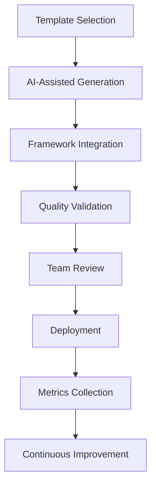

# Testing Framework Integration Guide

## Overview

This guide provides comprehensive instructions for integrating the strategic testing templates with popular testing frameworks, development workflows, and AI-assisted development tools. The templates are designed to work seamlessly with modern development practices while leveraging AI capabilities for enhanced productivity.

## Usage Instructions

### Quick Start Integration

1. **Select Your Testing Framework**: Choose from supported frameworks (Jest, Cypress, JUnit, pytest, xUnit)
2. **Configure Template Variables**: Set framework-specific variables in your template context
3. **Apply Template Prompts**: Use the provided Claude Code prompts with your framework configuration
4. **Integrate with CI/CD**: Configure your pipeline using the provided workflow examples
5. **Validate Implementation**: Use the verification scripts to ensure proper integration

### Step-by-Step Integration Process

**Phase 1: Framework Assessment**
- Identify your current testing stack and framework versions
- Review compatibility requirements and prerequisites
- Plan template adoption strategy based on team needs

**Phase 2: Template Configuration**
- Configure framework-specific template variables
- Customize prompts for your project context
- Set up development environment integration

**Phase 3: Implementation**
- Apply templates using provided Claude Code prompts
- Integrate generated tests into your test suites
- Configure CI/CD pipeline automation

**Phase 4: Validation**
- Run integration verification scripts
- Measure performance improvements
- Validate quality and coverage metrics

## Core Integration Principles

### AI-First Testing Approach

The strategic testing templates are designed with AI assistance in mind:

- **Prompt-driven test generation** using Claude Code for intelligent test creation
- **Context-aware testing** with repository analysis and code understanding
- **Adaptive test strategies** that evolve with codebase changes
- **Intelligent automation** that learns from development patterns

### Framework Agnostic Design

Templates support multiple testing frameworks through:

- **Universal testing patterns** that translate across frameworks
- **Configurable implementation details** for framework-specific syntax
- **Modular template structure** allowing selective adoption
- **Cross-platform compatibility** supporting diverse technology stacks

## Framework-Specific Integration

### JavaScript/TypeScript Testing Frameworks

#### Jest Integration

**Template Variables for Jest:**
```javascript
// Framework Context
TESTING_FRAMEWORK="Jest"
LANGUAGE="TypeScript"
ASSERTION_LIBRARY="Jest built-in"
MOCKING_FRAMEWORK="Jest mocks"
COVERAGE_TOOL="Jest coverage"

// Example Unit Test Generation Template Usage
// From: automated-unit-test-generation.md
```

**Claude Code Prompt for Jest Integration:**
```
Using the Automated Unit Test Generation template, create Jest test suites for the following TypeScript class:

**Framework Context**: Jest with TypeScript
**Test Requirements**: 
- Unit tests with comprehensive coverage
- Mock external dependencies
- Test edge cases and error conditions
- Follow Jest best practices

**Class to Test**: [paste your TypeScript class]

Generate complete Jest test suites with:
1. Setup and teardown procedures
2. Comprehensive test cases
3. Mock implementations
4. Coverage optimization
```

#### Cypress Integration

**End-to-End Testing with Cypress:**
```javascript
// Framework Context for E2E Templates
TESTING_FRAMEWORK="Cypress"
TEST_TYPE="End-to-End"
BROWSER_AUTOMATION="Cypress"
ASSERTION_STYLE="Cypress commands"

// Example Critical Path Testing Template Usage
// From: critical-path-testing.md
```

**Claude Code Prompt for Cypress Integration:**
```
Using the Critical Path Testing template, create Cypress test scenarios for critical business workflows:

**Application Context**: E-commerce checkout process
**Framework**: Cypress with TypeScript
**Critical Paths**: Payment processing, order completion, user authentication

Generate Cypress test suites including:
1. Page object models
2. Custom commands
3. Data fixtures
4. Environment configuration
5. CI/CD integration
```

### Java Testing Frameworks

#### JUnit 5 Integration

**Template Variables for JUnit:**
```java
// Framework Context
TESTING_FRAMEWORK="JUnit 5"
LANGUAGE="Java"
ASSERTION_LIBRARY="AssertJ"
MOCKING_FRAMEWORK="Mockito"
BUILD_TOOL="Maven/Gradle"

// Example Integration Testing Template Usage
// From: microservices-integration-testing.md
```

**Claude Code Prompt for JUnit Integration:**
```
Using the Microservices Integration Testing template, create JUnit 5 test suites for Spring Boot microservices:

**Framework Context**: JUnit 5 with Spring Boot Test
**Service Architecture**: RESTful microservices with database integration
**Testing Scope**: Service contracts, database integration, external API calls

Generate comprehensive JUnit test classes with:
1. Spring Boot test configuration
2. TestContainers for database testing
3. WireMock for external service mocking
4. Custom test slices for specific layers
```

#### TestNG Integration

**Enterprise Testing with TestNG:**
```java
// Framework Context
TESTING_FRAMEWORK="TestNG"
EXECUTION_MODEL="Parallel execution"
REPORTING="TestNG reports + Allure"
DATA_PROVIDER="TestNG DataProvider"

// Example Performance Testing Template Usage
// From: load-testing-performance-optimization.md
```

### Python Testing Frameworks

#### pytest Integration

**Template Variables for pytest:**
```python
# Framework Context
TESTING_FRAMEWORK="pytest"
LANGUAGE="Python"
ASSERTION_STYLE="pytest assertions"
FIXTURE_SYSTEM="pytest fixtures"
MOCKING_LIBRARY="pytest-mock"

# Example API Testing Template Usage
# From: api-contract-testing.md
```

**Claude Code Prompt for pytest Integration:**
```
Using the API Contract Testing template, create pytest test suites for FastAPI services:

**Framework Context**: pytest with FastAPI TestClient
**API Type**: REST API with OpenAPI specification
**Testing Scope**: Contract validation, schema compliance, error handling

Generate pytest test modules with:
1. Fixture-based test data
2. Parametrized test cases
3. API client mocking
4. Schema validation
5. Contract testing with Pact
```

### .NET Testing Frameworks

#### xUnit Integration

**Template Variables for xUnit:**
```csharp
// Framework Context
TESTING_FRAMEWORK="xUnit"
LANGUAGE="C#"
ASSERTION_LIBRARY="FluentAssertions"
MOCKING_FRAMEWORK="Moq"
DEPENDENCY_INJECTION="Microsoft.Extensions.DependencyInjection"

// Example Security Testing Template Usage
// From: security-vulnerability-assessment.md
```

## Development Workflow Integration

### CI/CD Pipeline Integration

#### GitHub Actions Integration

**Template Usage in GitHub Actions:**
```yaml
# .github/workflows/strategic-testing.yml
name: Strategic Testing Pipeline

on:
  push:
    branches: [main, develop]
  pull_request:
    branches: [main]

jobs:
  strategic-testing:
    runs-on: ubuntu-latest
    steps:
      - uses: actions/checkout@v3
      
      - name: Setup Testing Environment
        uses: ./.github/actions/setup-testing
        
      - name: Generate AI-Assisted Tests
        run: |
          # Use Claude Code with strategic testing templates
          claude-code generate-tests \
            --template="unit-test-generation" \
            --framework="jest" \
            --coverage-target="90%"
            
      - name: Execute Strategic Test Suite
        run: |
          # Run comprehensive test strategy
          npm run test:strategic \
            --parallel \
            --coverage \
            --performance-budget
            
      - name: Performance Testing
        run: |
          # Use load testing template
          claude-code generate-performance-tests \
            --template="load-testing-optimization" \
            --target-rps="1000"
```

#### Jenkins Integration

**Jenkinsfile for Strategic Testing:**
```groovy
pipeline {
    agent any
    
    environment {
        CLAUDE_API_KEY = credentials('claude-api-key')
        TESTING_FRAMEWORK = 'junit5'
    }
    
    stages {
        stage('AI-Assisted Test Generation') {
            steps {
                script {
                    // Generate tests using strategic templates
                    sh '''
                        claude-code generate-tests \
                          --template="integration-test-planning" \
                          --framework="${TESTING_FRAMEWORK}" \
                          --output="src/test/generated"
                    '''
                }
            }
        }
        
        stage('Strategic Test Execution') {
            parallel {
                stage('Unit Tests') {
                    steps {
                        sh 'mvn test -Dtest="**/*UnitTest"'
                    }
                }
                stage('Integration Tests') {
                    steps {
                        sh 'mvn test -Dtest="**/*IntegrationTest"'
                    }
                }
                stage('Performance Tests') {
                    steps {
                        sh 'mvn test -Dtest="**/*PerformanceTest"'
                    }
                }
            }
        }
    }
}
```

### IDE Integration

#### Claude Code Integration

**VS Code Configuration:**
```json
{
  "claude-code.templates": {
    "strategicTesting": {
      "enabled": true,
      "templatePath": "./content/templates/strategic-testing",
      "autoSuggest": true,
      "contextAware": true
    }
  },
  "claude-code.testing": {
    "framework": "auto-detect",
    "coverage": {
      "target": 90,
      "enforceGates": true
    },
    "ai-assistance": {
      "testGeneration": true,
      "refactoring": true,
      "optimization": true
    }
  }
}
```

**IntelliJ IDEA Integration:**
```xml
<!-- .idea/claude-code.xml -->
<component name="ClaudeCodeSettings">
  <option name="strategicTestingEnabled" value="true" />
  <option name="templateDirectory" value="content/templates/strategic-testing" />
  <option name="autoGenerateTests" value="true" />
  <option name="frameworkDetection" value="auto" />
</component>
```

## Template Customization Guide

### Framework-Specific Adaptations

#### Customizing Templates for Your Stack

**Example: Adapting Unit Test Generation for Angular:**
```typescript
// Template: automated-unit-test-generation.md
// Customization for Angular + Jasmine + Karma

**Framework Context**: Angular with Jasmine/Karma
**Component Type**: Angular Service with HTTP dependencies
**Testing Requirements**: 
- Angular TestBed configuration
- HTTP client mocking
- Dependency injection testing
- Observable stream testing

**Template Variables**:
- TESTING_FRAMEWORK="Jasmine/Karma"
- DI_FRAMEWORK="Angular DI"
- HTTP_TESTING="HttpClientTestingModule"
- ASYNC_TESTING="fakeAsync/tick"
```

#### Creating Custom Template Variations

**Custom Template Structure:**
```markdown
# Custom Framework Integration Template

## Framework-Specific Context
- **Base Template**: [reference to strategic template]
- **Framework**: [your specific framework]
- **Adaptations**: [framework-specific modifications]

## Implementation Examples
[Framework-specific examples using strategic template patterns]

## Integration Scripts
[Automation scripts for your development workflow]
```

### Configuration Management

#### Environment-Specific Configurations

**Development Environment:**
```yaml
# config/testing/development.yml
strategic_testing:
  framework: "jest"
  coverage_threshold: 80
  ai_assistance:
    enabled: true
    template_suggestions: true
  execution:
    parallel: true
    watch_mode: true
```

**Production Environment:**
```yaml
# config/testing/production.yml
strategic_testing:
  framework: "jest"
  coverage_threshold: 95
  ai_assistance:
    enabled: false
    template_validation: true
  execution:
    parallel: true
    strict_mode: true
    performance_budget: true
```

## Best Practices for Template Integration

### 1. Progressive Adoption Strategy

**Phase 1: Template Familiarization**
- Start with one template category (e.g., Unit Test Generation)
- Practice with existing codebase
- Establish team proficiency

**Phase 2: Workflow Integration**
- Integrate templates into daily development workflow
- Automate template usage in CI/CD pipelines
- Establish quality gates using template patterns

**Phase 3: Advanced Optimization**
- Customize templates for specific use cases
- Implement AI-powered automation
- Establish metrics and continuous improvement

### 2. Team Collaboration Patterns

**Template Sharing:**
```bash
# Team template repository structure
team-templates/
├── strategic-testing-base/     # Core strategic templates
├── framework-adaptations/      # Framework-specific versions
├── project-customizations/     # Project-specific modifications
└── automation-scripts/         # Integration automation
```

**Knowledge Sharing Sessions:**
- Weekly template showcases
- Framework-specific training
- AI assistance workshops
- Continuous improvement retrospectives

### 3. Quality Assurance Integration

**Template Validation Workflow:**


## Troubleshooting Common Integration Issues

### Framework Compatibility

**Issue**: Template syntax doesn't match framework conventions
**Solution**: Use framework-specific template variables and adapt syntax patterns

**Issue**: AI-generated tests don't follow team coding standards
**Solution**: Include coding standards in template context and use linting integration

### Performance Optimization

**Issue**: Template-generated tests are slow
**Solution**: Apply performance optimization patterns from template guidelines

**Issue**: CI/CD pipeline times increase with template usage
**Solution**: Implement parallel execution and intelligent test selection

### Team Adoption

**Issue**: Team resistance to AI-assisted testing
**Solution**: Start with simple templates and demonstrate value through metrics

**Issue**: Inconsistent template usage across team
**Solution**: Establish clear guidelines and automate template integration

## Advanced Integration Patterns

### Multi-Framework Projects

**Template Strategy for Polyglot Projects:**
```yaml
# multi-framework-config.yml
frameworks:
  frontend:
    framework: "cypress"
    templates: ["e2e-testing", "user-journey"]
  backend:
    framework: "junit5"
    templates: ["integration-testing", "api-contract"]
  mobile:
    framework: "espresso"
    templates: ["mobile-testing", "cross-platform"]
```

### Microservices Architecture

**Service-Specific Template Application:**
```bash
# Service testing strategy
for service in user-service order-service payment-service; do
  claude-code apply-template \
    --service="$service" \
    --template="microservices-integration" \
    --framework="spring-boot-test"
done
```

This integration guide enables teams to effectively adopt strategic testing templates across diverse technology stacks while leveraging AI assistance for enhanced productivity and quality outcomes.